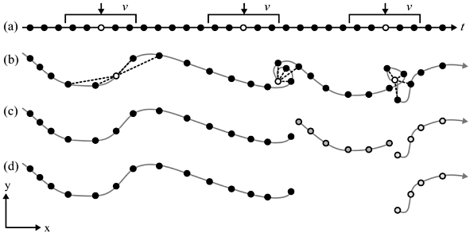

# Lesson 2
<!-- Enrich trajectories (step length, speed, 5min/3hrs) -->
<!-- Simple multi-scale analysis (with dplyr summarize for 5min and 3hrs) -->
<!-- Moving windows -->
<!-- Map back in space -->


## Learning Outcomes


## Prerequisites
Readings Skills from "R for Data Science" (Wickam, 2017):
<!-- Todo add bibtext -->

- RS2.1 Chap3 Data Transformation with dplyr (31p, 43-76)
- RS2.2 Chap10 Relational data with dplyr (21p, 171-193)
- RS2.3 Chap14 Pipes with magrittr (6p, 261-268)
- R2.1 Laube, P., & Purves, R. S. (2011). How fast is a cow?
cross‐scale analysis of movement data. Transactions in
GIS, 15(3), 401-418.

## Preperation

Open your R Project from last week. Load all libraries and run the scrip to import and clean your data. Install and load the following additional libraries.

<!-- Todo: add some comments as to what devtools does, and what CMAtools is -->
```{r, eval=F}
install.packages("devtools")
install.packages("zoo")

devtools::install_git("https://github.engineering.zhaw.ch/PatternsTrendsEnvironmentalData/CMAtools.git")
```

```{r}
library(CMAtools)
library(zoo)
```


## Tasks

### Task 1

Depending on your knowledge of R, getting an overview of the data we imported last week might have been quite a challange. Quite surprisingly, importing, cleaning and exploring your data can be the most challanging, time consuming part of a project. RStudio and the tidyverse offer many extremely helpful tools to make this part easier, and more fun. 

To get an overview of the data, use the dplyr tools group_by, summarise. Try to answer the following questions:

- How many individuals were tracked? 
- How long were the individual tracked? Are there gaps?
- Were all individuals tracked cuncurrently or sequentially? 
- What is the temporal sampling interval between the locations?


```{r, results=F}
## Task 1 ####################

ggplot(wildschwein_BE, aes(DatetimeUTC,TierID)) +
  geom_line()

wildschwein_BE <- wildschwein_BE %>%
  group_by(TierID) %>%
  mutate(
    timelag = as.numeric(difftime(lead(DatetimeUTC),DatetimeUTC,units = "mins"))
  )


ggplot(wildschwein_BE, aes(timelag)) +
  geom_histogram(binwidth = 50)

ggplot(wildschwein_BE, aes(timelag)) +
  geom_histogram(binwidth = 1) +
  lims(x = c(0,100)) +
  scale_y_log10()

wildschwein_BE[1:50,] %>%
  ggplot(aes(DatetimeUTC,timelag)) +
  geom_line() +
  geom_point()


```

### Task 2

<!-- Todo: this task is not much fun, pretty difficult and maybe not even that important. remove?  -->

Now that we've established that we have different sampling intervals, we have to segement our trajectories in such a way, that we can perform further analysis during specific sampling intervals only. If we measure speed, or turning angles, we have to be very clear on what temporal (an thus spatial) scale we are performing this analysis. 

We therefore have to define threshold to group segments with a similar sampling interval. Explore the dataset in more detail (e.g. using histograms at different scales), and choose reasonable threshold values to group the trajectories into different sampling intervals. Use the function cut() to apply the thresholds on the column timelag. 

Note: 

- It might make more sense to choose narrow group intervals at smaller timelags and wider groups intervals at higher timelags.
- The function cut splits a vector into segements according to the values specified in breaks = . The default lables can be a bit puzzling at first, but ( and ] are [a standard form of notating intervals in mathematics](https://en.wikipedia.org/wiki/Interval_%28mathematics%29#Notations_for_intervals). 


```{r}
## Task 2 ####################

ggplot(wildschwein_BE, aes(timelag)) +
  geom_histogram(binwidth = 0.1) +
  scale_x_continuous(breaks = seq(0,400,20),limits = c(0,400)) +
  # scale_x_continuous(breaks = seq(0,50,1),limits = c(0,50)) +
  scale_y_log10()

wildschwein_BE <- wildschwein_BE %>%
  group_by(TierID) %>%
  mutate(
    samplingInt = cut(timelag,breaks = c(0,5,seq(10,195,15)))
  ) 

wildschwein_BE %>%
  group_by(samplingInt) %>%
  summarise(
    n = n()
  ) %>%
  ggplot(aes(samplingInt,n)) +
  geom_bar(stat = "identity") +
  theme(axis.text.x = element_text(angle = 45, hjust = 1)) +
  scale_y_log10()


```

### Task 3

Now that we've gotten the nifty job of specifying our intervals out of the way, let's get to a more fun part and calculate the speed of the animals movements. 

- If you're working with dplyr, you can add samplingInt to group_by() (in addition to TierID) and so make sure your're not calculating speed across different sampling intervals. 
- You can use the function euclid() from the CMAtools package to calculate euclidean distances between subsequent rows. Use ?euclid to see what the function expects and returns. 
- use lead(E,1) to address the the row n+1
- make sure you're clear in what unit you are measuring speed. Meters per second is a SI base unit, but might be unhandy for the speeds travelled by wild boar.

```{r}
## Task 3 ####################

wildschwein_BE <- wildschwein_BE %>%
  group_by(TierID,samplingInt) %>%
  mutate(
    steplength = euclid(lead(E),lead(N),E,N),
    speed = steplength/timelag
  )

ggplot(wildschwein_BE, aes(samplingInt,speed,group = samplingInt)) +
  geom_boxplot() +
  scale_y_continuous(limits = c(0,100))

```
### Task 4

Measuring speed between subsequent samples is great, but especially for short sampling intervals they can be missleading due to measurment error. It might be desireble to "smoothen" these erros using a [moving window function](https://docs.wavefront.com/images/5sec_moving_window.png). The zoo package offeres a variaty of moving window functions (roll*). Use roll_mean to smoothen the calculated speed. Familiarise yourself with this function by working on some dummy data, for example:

```{r, include=T, results=F}
example <- rnorm(10)
rollmean(example,k = 3,fill = NA,align = "left")
rollmean(example,k = 4,fill = NA,align = "left")

```
Visualize the output from your moving windows and compare different window sizes (k = ). 


```{r}
## Task 4 ####################


wildschwein_BE <- wildschwein_BE %>%
  group_by(TierID) %>%
  mutate(
    speed2 = rollmean(speed,3,NA,align = "left"),
    speed3 = rollmean(speed,5,NA,align = "left"),
    speed4 = rollmean(speed,10,NA,align = "left")
  )

wildschwein_BE[1:30,] %>%
  gather(key,val,c(speed,speed2,speed3,speed4)) %>%
  ggplot(aes(DatetimeUTC,val,colour = key,group = key)) +
  geom_point() +
  geom_line() 
```

### Task 5

You've read Laube & Purves (2011) about segementing trajectories Let's use this same method on our wild boar data. Laube & Purves (2011) define "static" fixes as "those whose average Euclidean distance to other fixes inside a temporal window v is less than some
threshold d".
<!-- todo: add bibtext -->


<!-- Todo, add bibtex -->

We can nicely implement this method with the tools we've used so far. Let me illustrate on some dummy data:

```{r, include = T, purl = F}
set.seed(10)
X = cumsum(rnorm(20))
Y = cumsum(rnorm(20))

plot(X,Y, type = "l")
```

We'll assume they have a sampling interval of 5 minutes. If we take a temporal window of 20 minutes, that would mean we include 5 fixes into the calculation. We need to calculate the following Eucledian distances (pos representing a X,Y-position):

1. pos[n-2] to pos[n]
2. pos[n-1] to pos[n]
3. pos[n] to pos[n+1]
4. pos[n] to pos[n+2]

We can use the function euclid() to calculate the distances and dplyr functions lead()/lag() to create the necessary offsets.

```{r, include = T,purl = F}
nMinus2 <- euclid(lag(X, 2),lag(Y, 2),X,Y)  # distance to pos. -10 minutes
nMinus1 <- euclid(lag(X, 1),lag(Y, 1),X,Y)  # distance to pos.  -5 minutes
nPlus1 <- euclid(X,Y,lead(X, 1),lead(Y, 1)) # distance to pos   +5 mintues
nPlus2 <- euclid(X,Y,lead(X, 2),lead(Y, 2)) # distance to pos  +10 minutes

```

We can now bind all these values to a matrix:
```{r, include = T,purl = F}
distances <- cbind(nMinus2,nMinus1,nPlus1,nPlus2)
distances
```

We now need to find the mean value *per row*. mean() just gives us the overall mean
```{r, include = T,purl = F}
mean(distances, na.rm = T)
```

We therefore need the function rowMeans()
```{r, include = T,purl = F}

rowmeans <- rowMeans(distances)
cbind(distances,rowmeans)
```

You can now combine these steps to calculate the values for the wild boars. If you do it with dplyr::summarise(), you can make sure that the dataframe is grouped per animal and sampling interval via group_by(). 

```{r}

## Task 5 ####################

wildschwein_BE <- wildschwein_BE %>%
  group_by(TierID) %>%
  mutate(
    stepMean = rowMeans(
      cbind(
        euclid(lag(E, 2),lag(N, 2),E,N),
        euclid(lag(E, 1),lag(N, 1),E,N),
        euclid(E,N,lead(E, 1),lead(N, 1)),
        euclid(E,N,lead(E, 2),lead(N, 2))
        )
      )
  )
```

<!-- Todo: explore values, set threshold and explore segementation with tmap or similar -->

## Solutions (RCode)

```{r code=readLines('12_Week2/RFiles/W02_01_Exercise.R'), results='asis', echo = T, include=T, eval=F}
```