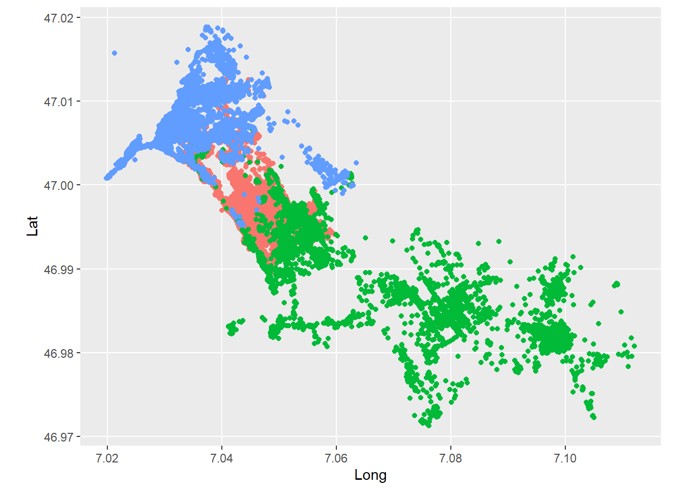
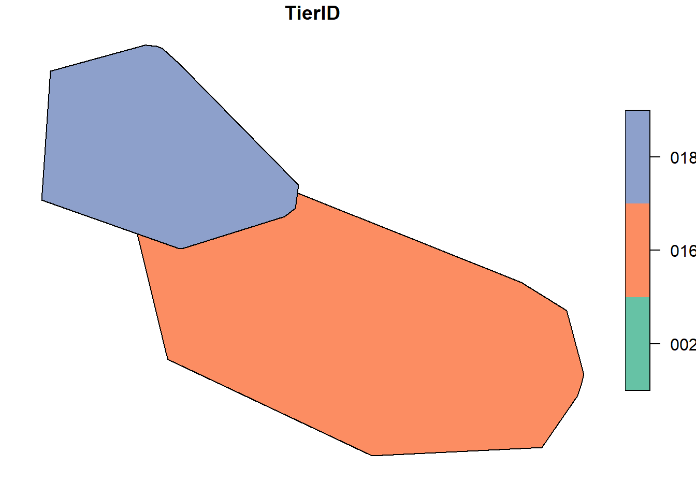
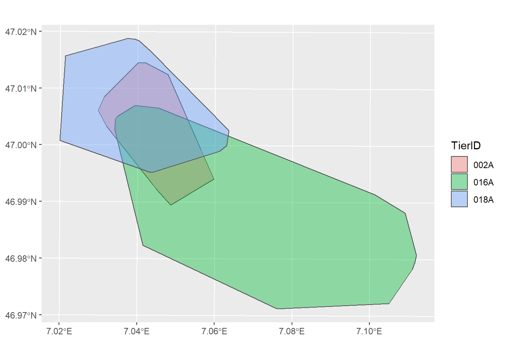
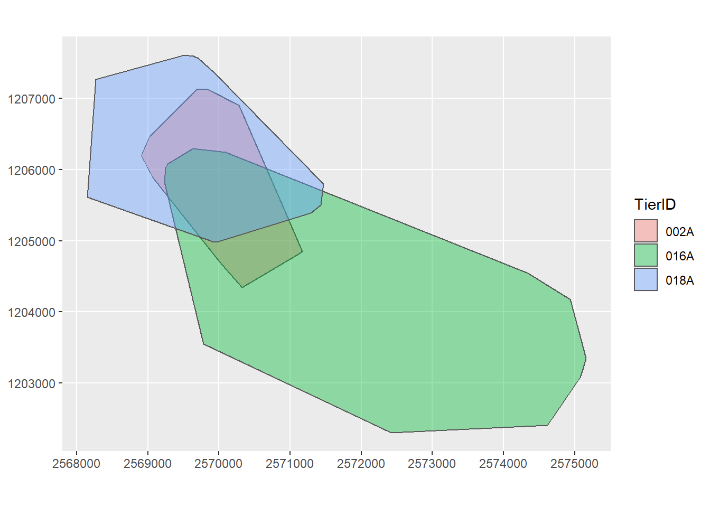
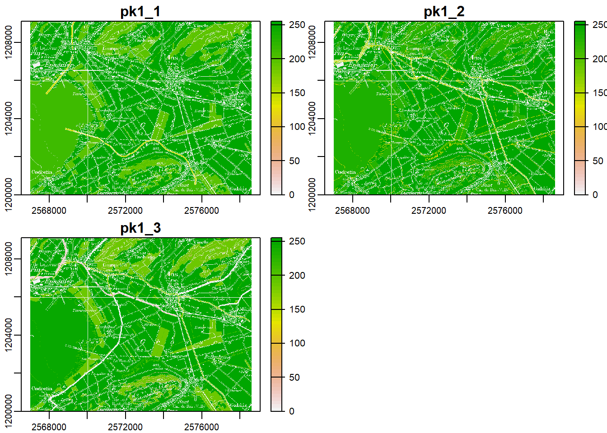
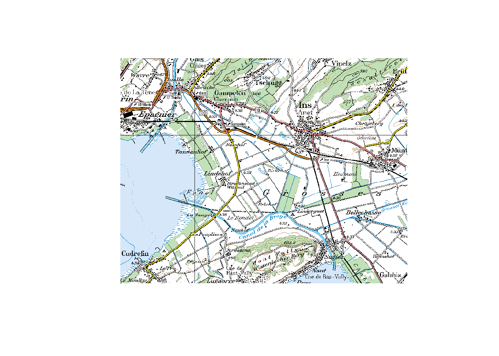
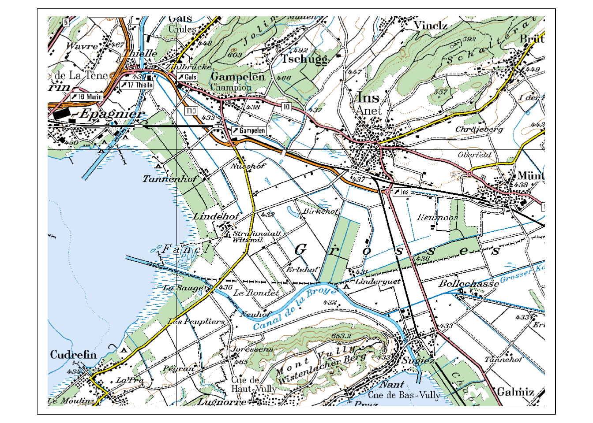
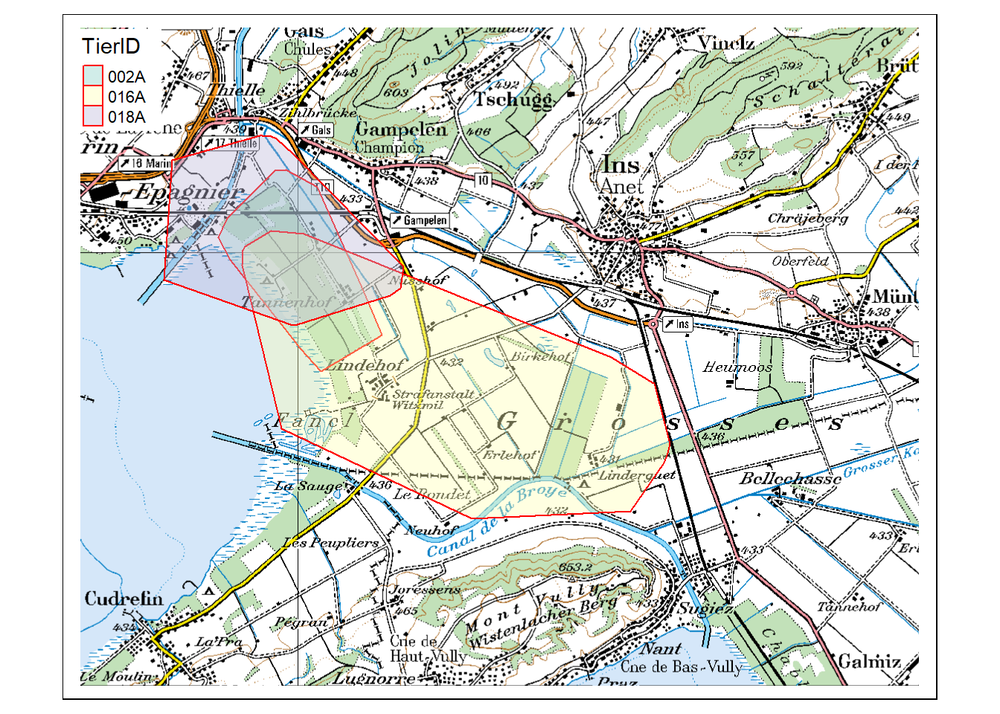

---
output:
  html_document: default
  pdf_document: default
---

## Tasks and inputs {#w1-tasks-and-inputs}


Before starting with the task:

1. make sure you have read and followed the instructions in section [Preparation](#w1-preparation)
2. In RStudio, open the RStudio Project you created for this week if you haven't done so already. You can see that you are in an RStudio Project if the project's name is visible next to the little RStudio logo in the top right corner of RStudio (otherwise it will read `Project: (None)`).
3. Download the wildboar movement data here: [wildschwein_BE.csv](https://github.com/ComputationalMovementAnalysis/FS21/raw/master/00_Rawdata/wildschwein_BE.csv) (right click "Save target as..")

Once you have set everything up, commit your file to your git repo in the following manner:


\BeginKnitrBlock{rmdtip}<div class="rmdtip">1. Save your (R/RMarkdown) file
2. Switch to the "Git"-Tab in the pane in the top right corner
3. Click "commit" to open the "commit-Window"
4. Click in the checkbox next to the file(s) you want to commit
5. Add a commit message to explain what you are committing (e.g. "`initial commit`")
6. Click on "commit" to commit your changes</div>\EndKnitrBlock{rmdtip}

### Task 1: Import data

Create a new R- (or RMarkdown) file and begin by loading the following packages: 


```r
library(readr)        # to import tabular data (e.g. csv)
```

```
## Warning: Paket 'readr' wurde unter R Version 4.0.5 erstellt
```

```r
library(dplyr)        # to manipulate (tabular) data
```

```
## Warning: Paket 'dplyr' wurde unter R Version 4.0.5 erstellt
```

```
## 
## Attache Paket: 'dplyr'
```

```
## The following object is masked from 'package:glue':
## 
##     collapse
```

```
## The following objects are masked from 'package:stats':
## 
##     filter, lag
```

```
## The following objects are masked from 'package:base':
## 
##     intersect, setdiff, setequal, union
```

```r
library(ggplot2)      # to visualize data
```

```
## Warning: Paket 'ggplot2' wurde unter R Version 4.0.5 erstellt
```


Move the file `wildschwein_BE.csv` into your project directory and import it into `r` as a `data.frame`.  Assign correct column types as necessary and make sure the time zone is set correctly for the date/time column.

Note: 

- We recommend using the `readr` package to import your data (they all begin with `read_*`, note the underscore). These functions are less error prone than the base `R` functions (`read.*`, note the period). Specifically for the wild boar data, we recommend `read_delim()`.
- For everyone working on the RStudio Server: You will first need to upload this data to the server using the "*upload*"-button in the "*Files*" tab.


```r
# Data import ####
wildschwein_BE <- read_delim("00_Rawdata/wildschwein_BE.csv",",")
```

```
## 
## -- Column specification --------------------------------------------------------
## cols(
##   TierID = col_character(),
##   TierName = col_character(),
##   CollarID = col_double(),
##   DatetimeUTC = col_datetime(format = ""),
##   Lat = col_double(),
##   Long = col_double()
## )
```

```r
# Check Timezone
attr(wildschwein_BE$DatetimeUTC,"tzone") # or
```

```
## [1] "UTC"
```

```r
wildschwein_BE$DatetimeUTC[1]
```

```
## [1] "2014-08-22 21:00:12 UTC"
```


Commit your changes as described [in the beginning](#w1-tasks-and-inputs). Write a meaningful commit message (e.g. "`completed task 1`").

### Task 2: Explore Data

We will use a range of different visualization tools (i.e. R-packages) in this course. Several packages techniques have emerged in recent years, each with their specific strengths and weaknesses. While `base::plot() `is quick and simple, it not very scalable with growing complexity. `ggplot2` offers solutions for most use cases and has an elegant, consistent syntax that is easy to get accustomed to. We will get to know other techniques later in the course.

Get an overview of your data by creating a first "map-like" plot of your data producing a simple scatter plot with `ggplot2`. 
Setting up a `ggplot` with our data is done using the command `ggplot(wildschwein_BE, aes(Long, Lat, colour = TierID))`. Creating a map is done via the basic scatter plot command `geom_point()`.
<!-- Use `coord_map()` to get a reasonable aspect ratio of `Lat` and `Long`. -->
Assigning every individual its own colour is done using the `ggplot` argument `colour =`.

Commit your changes as described [in the beginning](#w1-tasks-and-inputs). Have a look at your commit history by clicking on "History" in the "Git"-Pane.


```r
ggplot(wildschwein_BE, aes(Long,Lat, colour = TierID)) +
  geom_point() +
  coord_map() +
  theme(legend.position = "none")
```

<div class="figure">

<p class="caption">(\#fig:unnamed-chunk-4)Your plot should look something like this.</p>
</div>


### Input: Handling spatial data

Until now, we've stored our location data within data frames as Lat/Long columns. This works well for many tasks, but sometimes we need special *spatial* classes to handle our trajectories. We will get to know such cases in our next tasks, but first we need to convert our `data.frame` into a spatial object.

We will largely rely on `sf`when working with vector data in `R`. In order to transform our `data.frame` into an sf object, we need to use the function `st_as_sf()` while specifying the columns storing the coordinates and the coordinate reference system.

(At this point, we assume you know what a Coordinate Reference Systems is. Check out [this link](https://www.earthdatascience.org/courses/earth-analytics/spatial-data-r/intro-to-coordinate-reference-systems/) if this is not the case.)


```r
library(sf)
```

```
## Warning: Paket 'sf' wurde unter R Version 4.0.5 erstellt
```

```
## Linking to GEOS 3.9.0, GDAL 3.2.1, PROJ 7.2.1
```

```r
wildschwein_BE_sf <- st_as_sf(wildschwein_BE, 
                              coords = c("Long", "Lat"), 
                              crs = 4326)
```

Notice how `st_as_sf` takes the EPSG code for the `crs =` argument. You can find a lot of useful information on Coordinate Reference Systems (including EPSG Codes, etc.) under [epsg.io](http://epsg.io).  
Let's compare our original `data.frame` with this new `sf` object:


```r
wildschwein_BE
```

```
## # A tibble: 51,246 x 6
##    TierID TierName CollarID DatetimeUTC           Lat  Long
##    <chr>  <chr>       <dbl> <dttm>              <dbl> <dbl>
##  1 002A   Sabi        12275 2014-08-22 21:00:12  47.0  7.05
##  2 002A   Sabi        12275 2014-08-22 21:15:16  47.0  7.05
##  3 002A   Sabi        12275 2014-08-22 21:30:43  47.0  7.05
##  4 002A   Sabi        12275 2014-08-22 21:46:07  47.0  7.05
##  5 002A   Sabi        12275 2014-08-22 22:00:22  47.0  7.05
##  6 002A   Sabi        12275 2014-08-22 22:15:10  47.0  7.05
##  7 002A   Sabi        12275 2014-08-22 22:30:13  47.0  7.05
##  8 002A   Sabi        12275 2014-08-22 22:45:11  47.0  7.05
##  9 002A   Sabi        12275 2014-08-22 23:00:27  47.0  7.05
## 10 002A   Sabi        12275 2014-08-22 23:15:41  47.0  7.05
## # ... with 51,236 more rows
```

```r
wildschwein_BE_sf
```

```
## Simple feature collection with 51246 features and 4 fields
## Geometry type: POINT
## Dimension:     XY
## Bounding box:  xmin: 7.019889 ymin: 46.97125 xmax: 7.112075 ymax: 47.01882
## Geodetic CRS:  WGS 84
## # A tibble: 51,246 x 5
##    TierID TierName CollarID DatetimeUTC                    geometry
##  * <chr>  <chr>       <dbl> <dttm>                      <POINT [°]>
##  1 002A   Sabi        12275 2014-08-22 21:00:12 (7.049618 46.99317)
##  2 002A   Sabi        12275 2014-08-22 21:15:16 (7.049509 46.99416)
##  3 002A   Sabi        12275 2014-08-22 21:30:43 (7.049406 46.99383)
##  4 002A   Sabi        12275 2014-08-22 21:46:07 (7.049217 46.99375)
##  5 002A   Sabi        12275 2014-08-22 22:00:22 (7.049359 46.99375)
##  6 002A   Sabi        12275 2014-08-22 22:15:10 (7.049363 46.99382)
##  7 002A   Sabi        12275 2014-08-22 22:30:13 (7.049326 46.99387)
##  8 002A   Sabi        12275 2014-08-22 22:45:11 (7.049237 46.99395)
##  9 002A   Sabi        12275 2014-08-22 23:00:27 (7.048383 46.99481)
## 10 002A   Sabi        12275 2014-08-22 23:15:41 (7.049396 46.99373)
## # ... with 51,236 more rows
```

As you can see, `st_as_sf()` has added some metadata to our dataframe (`geometry type`, `dimension`, `bbox`, `epsg` and `proj4string`) and replaced the columns `Lat` and `Long` with a column named `geometry`. Other than that, the new `sf` object is very similar to our original dataframe. In fact, `sf` objects *are* essentially `dataframes`, as you can verify with the function `is.data.frame()`:


```r
is.data.frame(wildschwein_BE_sf)
```

```
## [1] TRUE
```

All operations we know from handling `data.frames` can be used on the `sf` object. Try some out!

```r
# subset rows
wildschwein_BE_sf[1:10,]
```

```
## Simple feature collection with 10 features and 4 fields
## Geometry type: POINT
## Dimension:     XY
## Bounding box:  xmin: 7.048383 ymin: 46.99317 xmax: 7.049618 ymax: 46.99481
## Geodetic CRS:  WGS 84
## # A tibble: 10 x 5
##    TierID TierName CollarID DatetimeUTC                    geometry
##    <chr>  <chr>       <dbl> <dttm>                      <POINT [°]>
##  1 002A   Sabi        12275 2014-08-22 21:00:12 (7.049618 46.99317)
##  2 002A   Sabi        12275 2014-08-22 21:15:16 (7.049509 46.99416)
##  3 002A   Sabi        12275 2014-08-22 21:30:43 (7.049406 46.99383)
##  4 002A   Sabi        12275 2014-08-22 21:46:07 (7.049217 46.99375)
##  5 002A   Sabi        12275 2014-08-22 22:00:22 (7.049359 46.99375)
##  6 002A   Sabi        12275 2014-08-22 22:15:10 (7.049363 46.99382)
##  7 002A   Sabi        12275 2014-08-22 22:30:13 (7.049326 46.99387)
##  8 002A   Sabi        12275 2014-08-22 22:45:11 (7.049237 46.99395)
##  9 002A   Sabi        12275 2014-08-22 23:00:27 (7.048383 46.99481)
## 10 002A   Sabi        12275 2014-08-22 23:15:41 (7.049396 46.99373)
```

```r
wildschwein_BE_sf[wildschwein_BE_sf$TierName == "Sabi",]
```

```
## Simple feature collection with 22746 features and 4 fields
## Geometry type: POINT
## Dimension:     XY
## Bounding box:  xmin: 7.029718 ymin: 46.98947 xmax: 7.059671 ymax: 47.01454
## Geodetic CRS:  WGS 84
## # A tibble: 22,746 x 5
##    TierID TierName CollarID DatetimeUTC                    geometry
##    <chr>  <chr>       <dbl> <dttm>                      <POINT [°]>
##  1 002A   Sabi        12275 2014-08-22 21:00:12 (7.049618 46.99317)
##  2 002A   Sabi        12275 2014-08-22 21:15:16 (7.049509 46.99416)
##  3 002A   Sabi        12275 2014-08-22 21:30:43 (7.049406 46.99383)
##  4 002A   Sabi        12275 2014-08-22 21:46:07 (7.049217 46.99375)
##  5 002A   Sabi        12275 2014-08-22 22:00:22 (7.049359 46.99375)
##  6 002A   Sabi        12275 2014-08-22 22:15:10 (7.049363 46.99382)
##  7 002A   Sabi        12275 2014-08-22 22:30:13 (7.049326 46.99387)
##  8 002A   Sabi        12275 2014-08-22 22:45:11 (7.049237 46.99395)
##  9 002A   Sabi        12275 2014-08-22 23:00:27 (7.048383 46.99481)
## 10 002A   Sabi        12275 2014-08-22 23:15:41 (7.049396 46.99373)
## # ... with 22,736 more rows
```

```r
# subset colums
wildschwein_BE_sf[,2:3]
```

```
## Simple feature collection with 51246 features and 2 fields
## Geometry type: POINT
## Dimension:     XY
## Bounding box:  xmin: 7.019889 ymin: 46.97125 xmax: 7.112075 ymax: 47.01882
## Geodetic CRS:  WGS 84
## # A tibble: 51,246 x 3
##    TierName CollarID            geometry
##    <chr>       <dbl>         <POINT [°]>
##  1 Sabi        12275 (7.049618 46.99317)
##  2 Sabi        12275 (7.049509 46.99416)
##  3 Sabi        12275 (7.049406 46.99383)
##  4 Sabi        12275 (7.049217 46.99375)
##  5 Sabi        12275 (7.049359 46.99375)
##  6 Sabi        12275 (7.049363 46.99382)
##  7 Sabi        12275 (7.049326 46.99387)
##  8 Sabi        12275 (7.049237 46.99395)
##  9 Sabi        12275 (7.048383 46.99481)
## 10 Sabi        12275 (7.049396 46.99373)
## # ... with 51,236 more rows
```

Instead of keeping the same data twice (once as a `data.frame`, and once as an `sf` object), we will overwrite the `data.frame` and continue working with the `sf` object from now on. This saves some memory space in `R` and avoids confusion. 


```r
wildschwein_BE <- st_as_sf(wildschwein_BE, 
                          coords = c("Long", "Lat"), 
                          crs = 4326)

rm(wildschwein_BE_sf) 
# we can remove this sf object, since it just eats up our memory
```


### Task 3: Project data from WGS84

So what can we do with our new `sf` object that we couldn't before? One example is projecting the WGS84 (`Lat`/`Long`) coordinates into the new Swiss CRS `CH1903+ LV95`[^50]. Do this by using the function `st_transform`. By the way, do you notice a pattern here? The package `sf` names most functions for spatial operations with the prefix `st_*`, just as in PostGIS.

[^50]: As we've mentioned in the first Input, you can look up the EPSG codes under (epsg.io)[http://epsg.io]. For information specific to Switzerland, check the [swisstopo website](https://www.swisstopo.admin.ch/en/knowledge-facts/surveying-geodesy/reference-systems.html) 


```r
wildschwein_BE <- st_transform(wildschwein_BE, 2056)
```


Here's the resulting `sf` object from the operation:

```r
wildschwein_BE
```

```
## Simple feature collection with 51246 features and 4 fields
## Geometry type: POINT
## Dimension:     XY
## Bounding box:  xmin: 2568153 ymin: 1202306 xmax: 2575154 ymax: 1207609
## Projected CRS: CH1903+ / LV95
## # A tibble: 51,246 x 5
##    TierID TierName CollarID DatetimeUTC                  geometry
##  * <chr>  <chr>       <dbl> <dttm>                    <POINT [m]>
##  1 002A   Sabi        12275 2014-08-22 21:00:12 (2570409 1204752)
##  2 002A   Sabi        12275 2014-08-22 21:15:16 (2570402 1204863)
##  3 002A   Sabi        12275 2014-08-22 21:30:43 (2570394 1204826)
##  4 002A   Sabi        12275 2014-08-22 21:46:07 (2570379 1204817)
##  5 002A   Sabi        12275 2014-08-22 22:00:22 (2570390 1204818)
##  6 002A   Sabi        12275 2014-08-22 22:15:10 (2570390 1204825)
##  7 002A   Sabi        12275 2014-08-22 22:30:13 (2570387 1204831)
##  8 002A   Sabi        12275 2014-08-22 22:45:11 (2570381 1204840)
##  9 002A   Sabi        12275 2014-08-22 23:00:27 (2570316 1204935)
## 10 002A   Sabi        12275 2014-08-22 23:15:41 (2570393 1204815)
## # ... with 51,236 more rows
```

Commit your changes as described [in the beginning](#w1-tasks-and-inputs).


### Input: Calculate Convex Hull

Transforming from one Coordinate Reference System to another was one operation where we needed an object with a spatial nature. In this way, we were able to use an off the shelf function to project the coordinates from one CRS to another. In our next example, we again rely on a spatial function: We want to calculate a [convex hull](https://en.wikipedia.org/wiki/Convex_hull) per Wild boar. And guess what the function for calculating a convex hull is called in `sf`? If you guessed `st_convex_hull()`, you were right! 

By default `st_convex_hull()` calculates the convex hull *per feature*, i.e. *per point* in our dataset. This of course makes little sense. In order to calculate the convex hull per animal, we need to convert our point- to multipoint-features where each feature contains all positions of one animal. This is achieved in two steps:

First: add a grouping variable to the `sf` object. Note the new grouping variable in the metadata of the `sf` object. Other than that, `group_by` has no effect on our `sf` object.


```r
wildschwein_BE_grouped <- group_by(wildschwein_BE,TierID)

wildschwein_BE_grouped
```

```
## Simple feature collection with 51246 features and 4 fields
## Geometry type: POINT
## Dimension:     XY
## Bounding box:  xmin: 2568153 ymin: 1202306 xmax: 2575154 ymax: 1207609
## Projected CRS: CH1903+ / LV95
## # A tibble: 51,246 x 5
## # Groups:   TierID [3]
##    TierID TierName CollarID DatetimeUTC                  geometry
##    <chr>  <chr>       <dbl> <dttm>                    <POINT [m]>
##  1 002A   Sabi        12275 2014-08-22 21:00:12 (2570409 1204752)
##  2 002A   Sabi        12275 2014-08-22 21:15:16 (2570402 1204863)
##  3 002A   Sabi        12275 2014-08-22 21:30:43 (2570394 1204826)
##  4 002A   Sabi        12275 2014-08-22 21:46:07 (2570379 1204817)
##  5 002A   Sabi        12275 2014-08-22 22:00:22 (2570390 1204818)
##  6 002A   Sabi        12275 2014-08-22 22:15:10 (2570390 1204825)
##  7 002A   Sabi        12275 2014-08-22 22:30:13 (2570387 1204831)
##  8 002A   Sabi        12275 2014-08-22 22:45:11 (2570381 1204840)
##  9 002A   Sabi        12275 2014-08-22 23:00:27 (2570316 1204935)
## 10 002A   Sabi        12275 2014-08-22 23:15:41 (2570393 1204815)
## # ... with 51,236 more rows
```


Second: use `summarise()` to "dissolve" all points into a mulipoint object. 


```r
wildschwein_BE_smry <- summarise(wildschwein_BE_grouped)

wildschwein_BE_smry
```

```
## Simple feature collection with 3 features and 1 field
## Geometry type: MULTIPOINT
## Dimension:     XY
## Bounding box:  xmin: 2568153 ymin: 1202306 xmax: 2575154 ymax: 1207609
## Projected CRS: CH1903+ / LV95
## # A tibble: 3 x 2
##   TierID                                                                geometry
##   <chr>                                                         <MULTIPOINT [m]>
## 1 002A   ((2568903 1206200), (2568925 1206207), (2568980 1206197), (2569024 120~
## 2 016A   ((2569231 1205823), (2569245 1205925), (2569247 1206027), (2569251 120~
## 3 018A   ((2568153 1205611), (2568155 1205613), (2568161 1205624), (2568162 120~
```


Now we can run `st_convex_hull` on the new `sf` object. 


```r
mcp <- st_convex_hull(wildschwein_BE_smry)
```


### Task 4: Ploting spatial objects

Using base plot to visualize `sf` objects is easy enough, just try the following code. 


```r
plot(mcp)
```



But since we use `ggplot` extensively, try and plot the object `mcp` with `ggplot`. Hint: Use the layer `geom_sf()` to add an `sf` object.
Note: `ggplot` refuses to use our specified CRS, so we need to force this by specifying `datum = ` in `coord_sf()`. Try it out.


```r
ggplot(mcp,aes(fill = TierID)) +
  geom_sf(alpha = 0.4)
```



```r
ggplot(mcp,aes(fill = TierID)) +
  geom_sf(alpha = 0.4) +
  coord_sf(datum = 2056)
```




Commit your changes as described [in the beginning](#w1-tasks-and-inputs). Have a look at your commit history by clicking on "History" in the "Git"-Pane.


### Input: Importing raster data

In the next task, we would like to add a background map to our `mcp` object. Download the file here: [pk100_BE.tif](https://github.com/ComputationalMovementAnalysis/FS21/raw/master/00_Rawdata/pk100_BE.tif) 
To import the file into `R`, we use the package `terra` with the function `rast`.


```r
library(terra)
```

```
## Warning: Paket 'terra' wurde unter R Version 4.0.5 erstellt
```

```
## terra version 1.1.17
```

```
## 
## Attache Paket: 'terra'
```

```
## The following objects are masked from 'package:dplyr':
## 
##     collapse, desc, near
```

```
## The following object is masked from 'package:glue':
## 
##     collapse
```

```r
pk100_BE <- terra::rast("00_Rawdata/pk100_BE.tif")

pk100_BE
```

```
## class       : SpatRaster 
## dimensions  : 1821, 2321, 3  (nrow, ncol, nlyr)
## resolution  : 5, 5  (x, y)
## extent      : 2567000, 2578605, 1199996, 1209101  (xmin, xmax, ymin, ymax)
## coord. ref. : +proj=somerc +lat_0=46.9524055555556 +lon_0=7.43958333333333 +k_0=1 +x_0=2600000 +y_0=1200000 +ellps=bessel +towgs84=674.374,15.056,405.346,0,0,0,0 +units=m +no_defs 
## source      : pk100_BE.tif 
## names       : pk1_1, pk1_2, pk1_3 
## min values  :     0,     0,     0 
## max values  :   255,   255,   255
```


`pk100_BE_2056.tif` is a three layered geotiff File. The above console output shows some metadata including the resolution, extent and the names of our layers (`pk1_1`, `pk1_2`etc). With the default `plot` method, each layer is displayed individually:


```r
plot(pk100_BE)
```



With `plotRGB` all three layers are combined into a single image:


```r
plotRGB(pk100_BE)
```




### Task 5: Adding a background map

There are multiple ways to add a background map in `ggplot`, many require additional packages. This is a good opportunity to get to know a completely different package for creating maps: `tmap` ("thematic map"). This package was developed with a syntax very similar to `ggplot2`, which makes it easy to learn.


```r
library(tmap)
```

```
## Warning: Paket 'tmap' wurde unter R Version 4.0.5 erstellt
```

```r
tm_shape(pk100_BE) + 
  tm_rgb() 
```

```
## Warning in showSRID(uprojargs, format = "PROJ", multiline = "NO", prefer_proj
## = prefer_proj): Discarded datum Unknown based on Bessel 1841 ellipsoid in CRS
## definition
```

```
## stars object downsampled to 1129 by 886 cells. See tm_shape manual (argument raster.downsample)
```


As you can see, plotting layers in `tmap` is combined with the `+` sign, just as in `ggplot2`. In `tmap` however, each layer consists of two objects: a `tm_shape()` in which the data is called, and a `tm_*` object in which we define how the data is visualized (`tm_rgb()` states that it is plotted as an RGB Raster Layer). Add the object `mcp` to the plot in this manner. Read [the vignette](https://cran.r-project.org/web/packages/tmap/vignettes/tmap-getstarted.html) if you are having trouble.


```r
library(tmap)


tm_shape(pk100_BE) + 
  tm_rgb() 
```

```
## Warning in showSRID(uprojargs, format = "PROJ", multiline = "NO", prefer_proj
## = prefer_proj): Discarded datum Unknown based on Bessel 1841 ellipsoid in CRS
## definition
```

```
## stars object downsampled to 1129 by 886 cells. See tm_shape manual (argument raster.downsample)
```



```r
tm_shape(pk100_BE) + 
  tm_rgb() +
  tm_shape(mcp) +
  tm_polygons(col = "TierID",alpha = 0.4,border.col = "red") +
  tm_legend(bg.color = "white")
```

```
## Warning in showSRID(uprojargs, format = "PROJ", multiline = "NO", prefer_proj
## = prefer_proj): Discarded datum Unknown based on Bessel 1841 ellipsoid in CRS
## definition
```

```
## stars object downsampled to 1129 by 886 cells. See tm_shape manual (argument raster.downsample)
```



Commit your changes as described [in the beginning](#w1-tasks-and-inputs).


### Task 6: Create an interactive map

Rerun the `tmap()...` command from the previous task, but switch the plotting mode to "view"" (`tmap_mode("view")`) beforehand. Omit the raster layer (`pk100_BE`), you won't be needing it.

Commit your changes as described [in the beginning](#w1-tasks-and-inputs). Have a look at your commit history by clicking on "History" in the "Git"-Pane.


```r
tmap_mode("view")
```

```
## tmap mode set to interactive viewing
```

```r
tm_shape(mcp) +
  tm_polygons(col = "TierID",alpha = 0.4,border.col = "red") +
  tm_legend(bg.color = "white")
```

```{=html}
<div id="htmlwidget-e562cb7acdeffaf032be" style="width:672px;height:480px;" class="leaflet html-widget"></div>
<script type="application/json" data-for="htmlwidget-e562cb7acdeffaf032be">{"x":{"options":{"crs":{"crsClass":"L.CRS.EPSG3857","code":null,"proj4def":null,"projectedBounds":null,"options":{}}},"calls":[{"method":"createMapPane","args":["tmap401",401]},{"method":"addProviderTiles","args":["Esri.WorldGrayCanvas",null,"Esri.WorldGrayCanvas",{"minZoom":0,"maxZoom":18,"tileSize":256,"subdomains":"abc","errorTileUrl":"","tms":false,"noWrap":false,"zoomOffset":0,"zoomReverse":false,"opacity":1,"zIndex":1,"detectRetina":false,"pane":"tilePane"}]},{"method":"addProviderTiles","args":["OpenStreetMap",null,"OpenStreetMap",{"minZoom":0,"maxZoom":18,"tileSize":256,"subdomains":"abc","errorTileUrl":"","tms":false,"noWrap":false,"zoomOffset":0,"zoomReverse":false,"opacity":1,"zIndex":1,"detectRetina":false,"pane":"tilePane"}]},{"method":"addProviderTiles","args":["Esri.WorldTopoMap",null,"Esri.WorldTopoMap",{"minZoom":0,"maxZoom":18,"tileSize":256,"subdomains":"abc","errorTileUrl":"","tms":false,"noWrap":false,"zoomOffset":0,"zoomReverse":false,"opacity":1,"zIndex":1,"detectRetina":false,"pane":"tilePane"}]},{"method":"addPolygons","args":[[[[{"lng":[7.0485673069553,7.04480010695054,7.04388090694936,7.03191630693396,7.02971800693093,7.03131540693212,7.03994030694012,7.04203140694239,7.04775800694908,7.05630880696145,7.05967110696632,7.05858900696524,7.0485673069553],"lat":[46.9894736104127,46.9923246104147,46.9930763104152,47.003360510422,47.0061217104236,47.0085111104241,47.0145212104245,47.0145358104241,47.0125095104219,46.9993116104148,46.9940891104119,46.9936355104121,46.9894736104127]}]],[[{"lng":[7.07619130698957,7.0414600069492,7.04114270694867,7.03405870693643,7.03425300693622,7.03468420693658,7.03929650694115,7.04535300694784,7.10132590701219,7.10904380702132,7.10912860702142,7.11207480702635,7.11165290702618,7.1110452070258,7.10499670702065,7.07619130698957],"lat":[46.9712499103991,46.9823290104115,46.9831421104119,47.0027406104213,47.0045792104219,47.005043010422,47.0070029104217,47.0065901104202,46.9914530104013,46.9882352103983,46.9881850103982,46.9807710103946,46.9795645103942,46.9783256103939,46.9722751103929,46.9712499103991]}]],[[{"lng":[7.04377190694875,7.04330840694825,7.01988930692145,7.02124780691949,7.03724010693618,7.03765310693663,7.03931370693846,7.04024220693953,7.04327770694326,7.06348590696848,7.06296120696853,7.06113770696678,7.04377190694875],"lat":[46.9952165104161,46.9952182104162,47.0007840104237,47.0157176104293,47.0188050104268,47.0188231104267,47.0187111104263,47.018454010426,47.0166098104246,47.0026493104145,46.9999647104135,46.9989840104136,46.9952165104161]}]]],["X002A","X016A","X018A"],"mcp",{"interactive":true,"className":"","pane":"tmap401","stroke":true,"color":"#FF0000","weight":1,"opacity":1,"fill":true,"fillColor":["#8DD3C7","#FFFFB3","#BEBADA"],"fillOpacity":[0.4,0.4,0.4],"dashArray":"none","smoothFactor":1,"noClip":false},["<style> div.leaflet-popup-content {width:auto !important;overflow-y:auto; overflow-x:hidden;}<\/style><div style=\"max-height:25em;padding-right:0px;\"><table>\n\t\t\t   <thead><tr><th colspan=\"2\"><b>002A<\/b><\/th><\/thead><\/tr><tr><td style=\"color: #888888;\"><nobr>TierID<\/nobr><\/td><td align=\"right\"><nobr>002A<\/nobr><\/td><\/tr><\/table><\/div>","<style> div.leaflet-popup-content {width:auto !important;overflow-y:auto; overflow-x:hidden;}<\/style><div style=\"max-height:25em;padding-right:0px;\"><table>\n\t\t\t   <thead><tr><th colspan=\"2\"><b>016A<\/b><\/th><\/thead><\/tr><tr><td style=\"color: #888888;\"><nobr>TierID<\/nobr><\/td><td align=\"right\"><nobr>016A<\/nobr><\/td><\/tr><\/table><\/div>","<style> div.leaflet-popup-content {width:auto !important;overflow-y:auto; overflow-x:hidden;}<\/style><div style=\"max-height:25em;padding-right:0px;\"><table>\n\t\t\t   <thead><tr><th colspan=\"2\"><b>018A<\/b><\/th><\/thead><\/tr><tr><td style=\"color: #888888;\"><nobr>TierID<\/nobr><\/td><td align=\"right\"><nobr>018A<\/nobr><\/td><\/tr><\/table><\/div>"],null,["002A","016A","018A"],{"interactive":false,"permanent":false,"direction":"auto","opacity":1,"offset":[0,0],"textsize":"10px","textOnly":false,"className":"","sticky":true},null]},{"method":"addLegend","args":[{"colors":["#8DD3C7","#FFFFB3","#BEBADA"],"labels":["002A","016A","018A"],"na_color":null,"na_label":"NA","opacity":0.4,"position":"topright","type":"unknown","title":"TierID","extra":null,"layerId":"legend401","className":"info legend mcp","group":"mcp"}]},{"method":"addLayersControl","args":[["Esri.WorldGrayCanvas","OpenStreetMap","Esri.WorldTopoMap"],"mcp",{"collapsed":true,"autoZIndex":true,"position":"topleft"}]}],"limits":{"lat":[46.9712499103991,47.0188231104267],"lng":[7.01988930692145,7.11207480702635]},"fitBounds":[46.9712499103991,7.01988930692145,47.0188231104267,7.11207480702635,[]]},"evals":[],"jsHooks":[]}</script>
```

