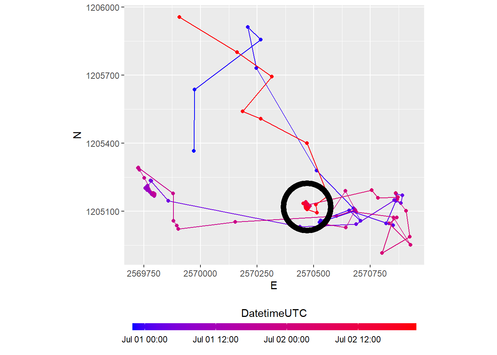
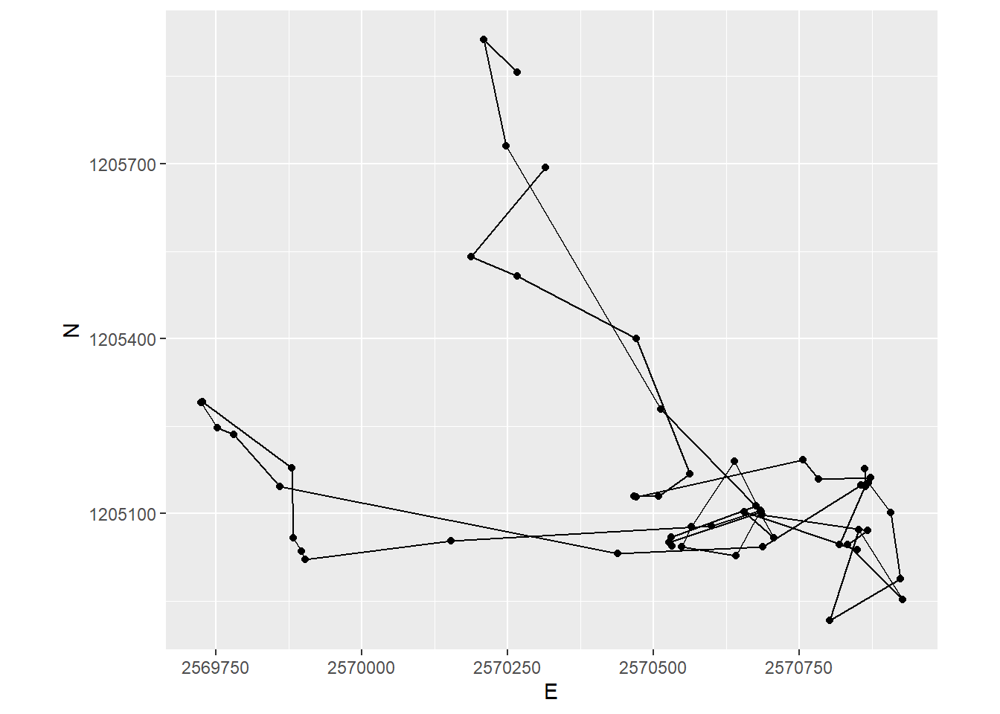
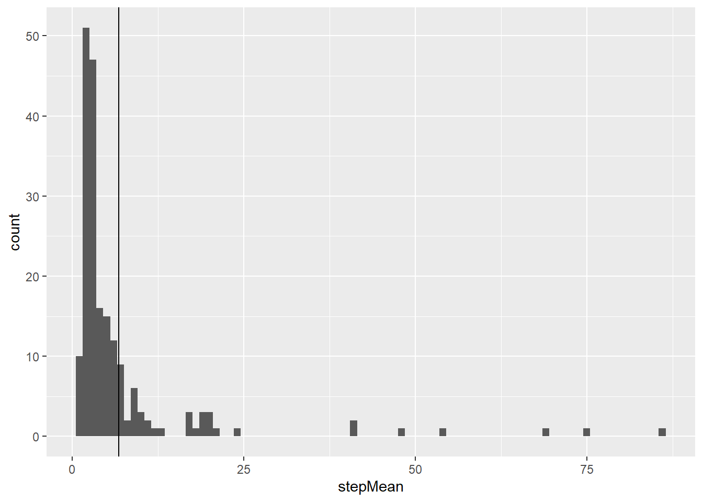
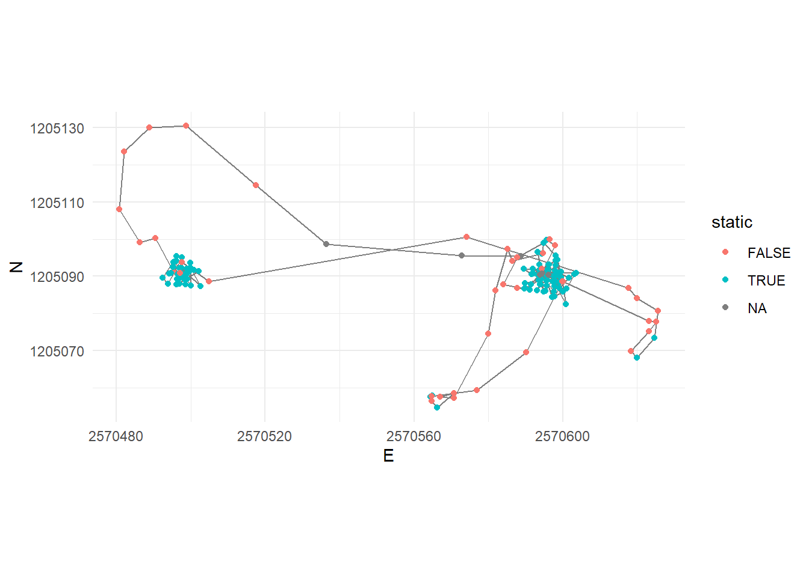
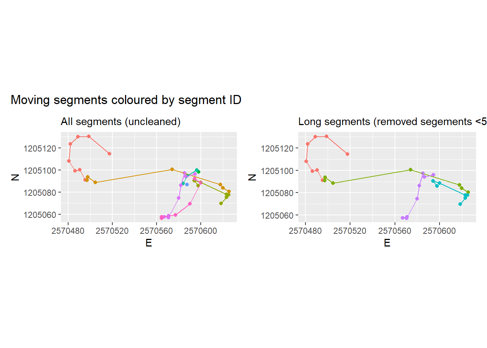
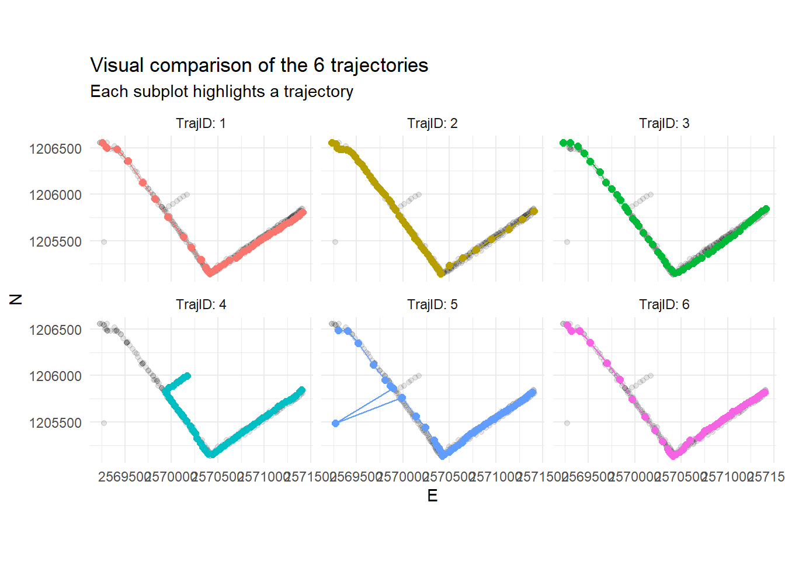
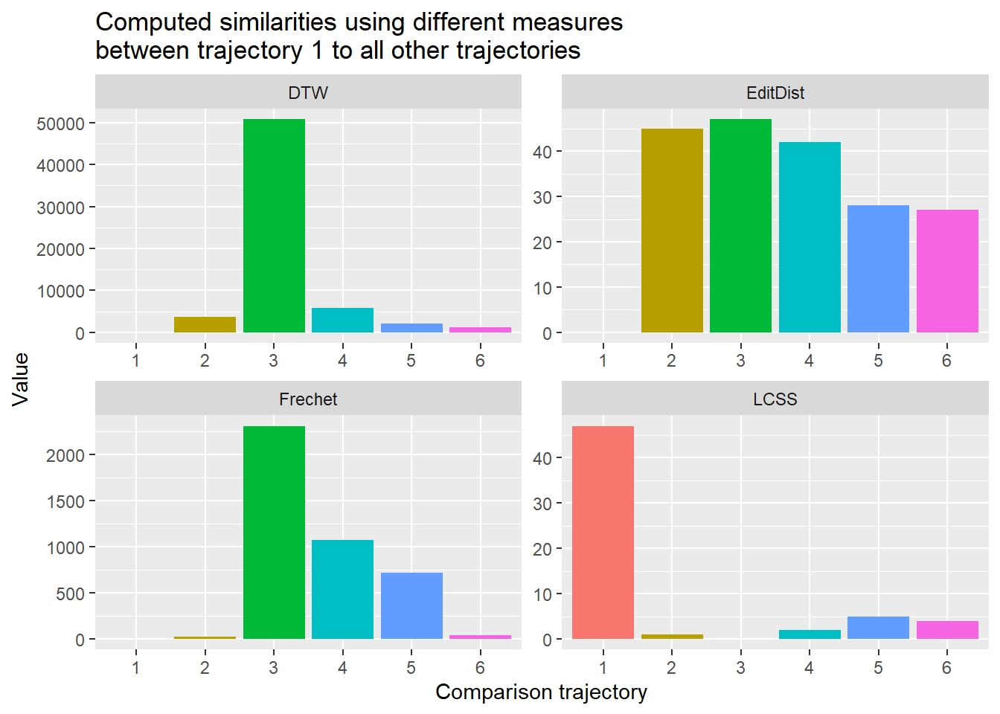

## Tasks and Inputs


You've read @laube2011 about segmenting trajectories. In the paper, the authors define "*static*" fixes as "*those whose average Euclidean distance to other fixes inside a temporal window v is less than some threshold d*", as illustrated in the following figure:

(ref:laubeimg) The figure from @laube2011 visualizes steps a) zu d), which will be explained below:

<div class="figure">

<p class="caption">(\#fig:laubeimg)(ref:laubeimg)</p>
</div>

(a) Specify a temporal windows $v$ for in which to measure Euclidean distances
(b) Measure the distance from every point to every other point within this temporal window ($v$)
(c) Remove "static points": These are points  where the average distance is less than a given threshold. This segments the trajectory into subtrajectories
(d) Now remove short subtrajectories: These are trajectories with a short duration (whereas "short" is tbd)


We will demonstrate implementing this method on the wild boar "Sabi", restricting ourselves to a couple of tracking days. Your task will be to understand this implementation and apply it on Caro, with a different sampling interval.


```r
library(readr)
```

```
## Warning: Paket 'readr' wurde unter R Version 4.0.5 erstellt
```

```r
library(dplyr)
```

```
## Warning: Paket 'dplyr' wurde unter R Version 4.0.5 erstellt
```

```
## 
## Attache Paket: 'dplyr'
```

```
## The following objects are masked from 'package:stats':
## 
##     filter, lag
```

```
## The following objects are masked from 'package:base':
## 
##     intersect, setdiff, setequal, union
```

```r
library(ggplot2)
```

```
## Warning: Paket 'ggplot2' wurde unter R Version 4.0.5 erstellt
```

```r
wildschwein <- read_delim("00_Rawdata/wildschwein_BE_2056.csv",",")
```

```
## 
## -- Column specification --------------------------------------------------------
## cols(
##   TierID = col_character(),
##   TierName = col_character(),
##   CollarID = col_double(),
##   DatetimeUTC = col_datetime(format = ""),
##   E = col_double(),
##   N = col_double()
## )
```

```r
sabi <- wildschwein %>%
  filter(TierName == "Sabi", DatetimeUTC >= "2015-07-01", DatetimeUTC < "2015-07-03")
```


```r
ggplot(sabi, aes(E, N, color = DatetimeUTC))  +
  geom_point() +
  geom_path() +
  coord_fixed() +
  scale_color_datetime(low = "blue", high = "red") +
  guides(color = guide_colorbar(title.position = 'top', title.hjust = .5, barwidth = unit(20, 'lines'), barheight = unit(.5, 'lines'))) +
  theme(legend.position = "bottom") +
  geom_point(y = 1205120, x = 2570470, size = 20, pch = 21, color = "black", stroke = 4)
```

<div class="figure">

<p class="caption">(\#fig:unnamed-chunk-3)Movement of the wildboar 'Sabi' in the timespan 01-02.07.2015. The circle highlingts possible 'static points'</p>
</div>


#### Step a): Specify a temporal window $v$

In the above dataset, the sampling interval is 15 minutes. If we take a temporal window of 60 minutes, that would mean including 4 fixes. We need to calculate the following Euclidean distances (pos representing single location):

1. `pos[n-2]` to `pos[n]`
2. `pos[n-1]` to `pos[n]`
3. `pos[n]` to `pos[n+1]`
4. `pos[n]` to `pos[n+2]`


#### Step b): Measure the distance from every point to every other point within this temporal window $v$

Just like last week, we use the formula for calculating the Euclidean distance in in combination with `lead()` and `lag()`. For example, to create the necessary offset of n-2, we use `lag(x, 2)`. For each offset, we create one individual column.


```r
sabi <- sabi %>%
  mutate(
    nMinus2 = sqrt((lag(E,2)-E)^2+(lag(N,2)-N)^2),   # distance to pos -30 minutes
    nMinus1 = sqrt((lag(E,1)-E)^2+(lag(N,1)-N)^2),   # distance to pos -15 minutes
    nPlus1  = sqrt((E-lead(E,1))^2+(N-lead(N,1))^2), # distance to pos +15 mintues
    nPlus2  = sqrt((E-lead(E,2))^2+(N-lead(N,2))^2)  # distance to pos +30 minutes
  )
```

Now we want to calculate the mean distance of `nMinus2`, `nMinus1`, `nPlus1`, `nPlus2` for each row. Since we want the mean value *per Row*, we have to explicitly specify this before `mutate()` with the function `rowwise()`. To remove this rowwise-grouping, we end the operation with `ungroup()`. 

Note that for the first two positions, we cannot calculate a `stepMean` since there is no Position `n-2` for these positions. This is also true for the last to positions (lacking a position `n+2`).


```r
sabi <- sabi %>%
  rowwise() %>%
  mutate(
    stepMean = mean(c(nMinus2, nMinus1,nPlus1,nPlus2))
  ) %>%
  ungroup() 

sabi
```

```
## # A tibble: 192 x 11
##    TierID TierName CollarID DatetimeUTC                E       N nMinus2 nMinus1
##    <chr>  <chr>       <dbl> <dttm>                 <dbl>   <dbl>   <dbl>   <dbl>
##  1 002A   Sabi        12275 2015-06-30 22:00:13 2569972.  1.21e6   NA      NA   
##  2 002A   Sabi        12275 2015-06-30 22:16:06 2569975.  1.21e6   NA     271.  
##  3 002A   Sabi        12275 2015-06-30 22:30:19 2570266.  1.21e6  573.    365.  
##  4 002A   Sabi        12275 2015-06-30 22:45:13 2570208.  1.21e6  361.     80.5 
##  5 002A   Sabi        12275 2015-06-30 23:00:10 2570247.  1.21e6  127.    186.  
##  6 002A   Sabi        12275 2015-06-30 23:15:17 2570512.  1.21e6  703.    524.  
##  7 002A   Sabi        12275 2015-06-30 23:30:38 2570684.  1.21e6  766.    247.  
##  8 002A   Sabi        12275 2015-06-30 23:45:16 2570526.  1.21e6  229.    167.  
##  9 002A   Sabi        12275 2015-07-01 00:00:10 2570532.  1.21e6  163.      9.33
## 10 002A   Sabi        12275 2015-07-01 00:15:14 2570530.  1.21e6    8.98   15.4 
## # ... with 182 more rows, and 3 more variables: nPlus1 <dbl>, nPlus2 <dbl>,
## #   stepMean <dbl>
```


#### Step c): Remove "static points"

We can now determine if an animal is moving or not by specifying a threshold distance on `stepMean`. In our example, we use the mean value as a threshold: Positions with distances below this value are considered static.


```r
sabi <- sabi %>% 
  ungroup() %>%
  mutate(static = stepMean < mean(stepMean, na.rm = TRUE))


sabi_filter <- sabi %>%
  filter(!static)

sabi_filter%>%
  ggplot(aes(E, N))  +
  geom_path() +
  geom_point() +
  coord_fixed() +
  theme(legend.position = "bottom")
```

<div class="figure">

<p class="caption">(\#fig:unnamed-chunk-6)The trajectory of sabi, filtered to the positions where the animal was not static</p>
</div>


### Task 1: Segmentation

If you haven't already done so open the RStudio Project [you have prepared](#w3-preparation) for this week.

With the skills from the input above you can now implement the segmentation algorithm described in @laube2011 on the dataset [caro60.csv](https://github.com/ComputationalMovementAnalysis/FS21/raw/master/00_Rawdata/caro60.csv). Download this dataset (right click > save target as...) and import it as a simple `data.frame` or `tibble` (you don't need an `sf`-object for today's task).

The sampling interval for this dataset is 1 minute. Use a temporal window $v$ of 6 minutes, i.e. a window size of 6 positions (`n±3`). 

Once you have completed the task, commit your changes with a meaningful commit message and test your connection to Github by pushing your changes to your remote repository.


```r
library(readr)
library(dplyr)
library(ggplot2)


caro60 <- read_delim("00_Rawdata/caro60.csv",",")
```

```
## 
## -- Column specification --------------------------------------------------------
## cols(
##   TierID = col_character(),
##   TierName = col_character(),
##   CollarID = col_double(),
##   DatetimeUTC = col_datetime(format = ""),
##   E = col_double(),
##   N = col_double()
## )
```

```r
caro60 <- caro60 %>%
  mutate(
    stepMean = rowMeans(                       
      cbind(                                   
        sqrt((lag(E,3)-E)^2+(lag(E,3)-E)^2),   
        sqrt((lag(E,2)-E)^2+(lag(E,2)-E)^2),   
        sqrt((lag(E,1)-E)^2+(lag(E,1)-E)^2),   
        sqrt((E-lead(E,1))^2+(E-lead(E,1))^2),  
        sqrt((E-lead(E,2))^2+(E-lead(E,2))^2),
        sqrt((E-lead(E,3))^2+(E-lead(E,3))^2)  
        )                                        
    )
  )

# Note: 
# We present here a slightly different approach as presented in the input:
# - cbind() creates a matrix with the same number of rows as the original dataframe
# - It has 6 columns, one for each Euclidean distance calculation
# - rowMeans() returns a single vector with the same number of rows as the original dataframe
```


### Task 2: Specify and apply threshold *d*


After calculating the Euclidean distances to positions within the temporal window *v* in task 1, you can explore these values (we stored them in the column `stepMean`) using summary statistics (histograms, boxplot, `summary()`): This way we can define a reasonable threshold value to differentiate between *stops* and *moves*. There is no "correct" way of doing this, specifying a threshold always depends on data as well as the question that needs to be answered. In this exercise, use the mean of all `stepMean` values.

Store the new information (boolean to differentiate between stops (`TRUE`) and moves (`FALSE`)) in a new column named `static`.

Commit your changes with a meaningful commit message. 


```r
summary(caro60$stepMean)
```

```
##    Min. 1st Qu.  Median    Mean 3rd Qu.    Max.    NA's 
##  0.6417  2.1858  3.1216  6.7741  6.0652 85.6911       6
```

```r
ggplot(caro60, aes(stepMean)) +
  geom_histogram(binwidth = 1) +
  geom_vline(xintercept = mean(caro60$stepMean,na.rm = TRUE))
```

```
## Warning: Removed 6 rows containing non-finite values (stat_bin).
```



```r
caro60 <- caro60 %>%
  mutate(
    static = stepMean < mean(caro60$stepMean,na.rm = TRUE)
  ) 
```


### Task 3: Visualize segmented trajectories

Now visualize the segmented trajectory spatially. Just like last week, you can use ggplot with `geom_path()`, `geom_point()` and `coord_equal()`. Assign `colour = static` within `aes()` to distinguish between segments *with* "movement" and *without*.

Commit your changes with a meaningful commit message. 


```r
caro60 %>%
  ggplot() +
  geom_path(aes(E,N), alpha = 0.5) +
  geom_point(aes(E,N,colour = static)) +
  theme_minimal() +
  coord_equal()
```




### Task 4: Segment-based analysis

In applying @laube2011, we've come as far as steps b in figure \@ref(fig:laubeimg). In order to complete the last steps (c and d), we need a *unique* ID for each segment that we can use as a grouping variable. The following function does just that (it assigns unique IDs based on the column `static` which you created in Task 2). You will learn about functions next week. For now, just copy the following code chunk into your script and run it.


```r
rle_id <- function(vec){
  x <- rle(vec)$lengths
  as.factor(rep(seq_along(x), times=x))
  }
```


You can use the newly created function `rle_id` to assign unique IDs to subtrajectories (as shown below). Visualize the *moving* segments by colourizing them by `segment_ID`. 
Then use `segment_ID` as a grouping variable to determine the segments duration and remove short segments (e.g. segments with a duration < 10 Minutes) 

Commit your changes with a meaningful commit message. 


```r
caro60 <- caro60 %>%
  mutate(segment_id = rle_id(static))

caro60
```

```
## # A tibble: 200 x 9
##    TierID TierName CollarID DatetimeUTC                E       N stepMean static
##    <chr>  <chr>       <dbl> <dttm>                 <dbl>   <dbl>    <dbl> <lgl> 
##  1 010C   Caro        13973 2015-09-15 08:07:00 2570589.  1.21e6    NA    NA    
##  2 010C   Caro        13973 2015-09-15 08:08:00 2570573.  1.21e6    NA    NA    
##  3 010C   Caro        13973 2015-09-15 08:09:00 2570536.  1.21e6    NA    NA    
##  4 010C   Caro        13973 2015-09-15 08:10:00 2570518.  1.21e6    53.8  FALSE 
##  5 010C   Caro        13973 2015-09-15 08:11:00 2570499.  1.21e6    41.2  FALSE 
##  6 010C   Caro        13973 2015-09-15 08:12:00 2570489.  1.21e6    24.4  FALSE 
##  7 010C   Caro        13973 2015-09-15 08:13:00 2570482.  1.21e6    17.1  FALSE 
##  8 010C   Caro        13973 2015-09-15 08:14:00 2570481.  1.21e6    13.4  FALSE 
##  9 010C   Caro        13973 2015-09-15 08:15:00 2570486.  1.21e6     9.05 FALSE 
## 10 010C   Caro        13973 2015-09-15 08:16:00 2570490.  1.21e6    10.1  FALSE 
## # ... with 190 more rows, and 1 more variable: segment_id <fct>
```


```r
caro60 <-caro60 %>%
  mutate(
    segment_ID = rle_id(static)
  )

caro60_moves <- caro60 %>%
  filter(!static)


p1 <- ggplot(caro60_moves, aes(E, N, color = segment_ID)) +
  geom_point() +
  geom_path() +
  coord_equal() +
  theme(legend.position = "none") +
  labs(subtitle =  "All segments (uncleaned)")


p2 <- caro60_moves %>%
  group_by(segment_ID) %>%
  mutate(duration = as.integer(difftime(max(DatetimeUTC),min(DatetimeUTC),"mins"))) %>%
  filter(duration > 5) %>%
  ggplot(aes(E, N, color = segment_ID))+
  # geom_point(data = caro60, color = "black") +
  geom_point() +
  geom_path() +
  coord_equal() +
  theme(legend.position = "none") +
  labs(subtitle = "Long segments (removed segements <5 minutes)")
```


```r
library(patchwork)
```

```
## Warning: Paket 'patchwork' wurde unter R Version 4.0.4 erstellt
```

```r
p1 + p2 + patchwork::plot_annotation(title = "Moving segments coloured by segment ID")
```



### Task 5: Similarity measures 

We will now leave the wild boar data and turn our attentian to human movement. You will use the dataset  [pedestrian.csv](https://github.com/ComputationalMovementAnalysis/FS21/raw/master/00_Rawdata/pedestrian.csv) (right click > save target as..) for this (and the following) task. Download an import this dataset as a `data.frame`  or `tibble`. It it a set of six different but similar trajectories from pedestrians walking on a path. 

or this task, explore the trajectories first and get an idea on how the pedestrians moved. We step away from using the wild boar data for this task because our animals don't express the type of similarity we want to illustrate here. Also, using the constructed pedestrian data allows us illustrating very typical similarity issues, that are picked-up in different ways by the different similarity measures. In later exercises we will get back to our wild boar!

Commit your changes with a meaningful commit message. 


```r
pedestrians <- read_delim("00_Rawdata/pedestrian.csv",",")
```

```
## 
## -- Column specification --------------------------------------------------------
## cols(
##   TrajID = col_double(),
##   E = col_double(),
##   N = col_double(),
##   DatetimeUTC = col_datetime(format = "")
## )
```

```r
ggplot(pedestrians, aes(E,N)) +
  geom_point(data = dplyr::select(pedestrians, -TrajID),alpha = 0.1) +
  geom_point(aes(color = as.factor(TrajID)), size = 2) +
  geom_path(aes(color = as.factor(TrajID))) +
  facet_wrap(~TrajID,labeller = label_both) +
  coord_equal() +
  theme_minimal() +
  labs(title = "Visual comparison of the 6 trajectories", subtitle = "Each subplot highlights a trajectory") +
  theme(legend.position = "none")
```




### Task 6: Calculate similarity

Install the package `SimilarityMeasures` (`install.packages("SimilarityMeasures")`). Familiarize yourself with this package by skimming through the function descriptions `help(package = "SimilarityMeasures")`. Now compare trajectory 1 to trajectories 2-6 using different similarity measures from the package. Your options are. `DTW`, `EditDist`, `Frechet` and `LCSS`.

Visualize your results and try to understand the different results with respect to your reading of @both2018. Can you see connections between the properties of the trajectories and the similarity values computed by the different measures?

Note: 

- All functions in the package need matrices as input, with one trajectory per matrix. 
- `LCSS`takes very long to compute. The accuracy of the algorithm (`pointSpacing =` ,`pointDistance =` and `errorMarg =`) can be varied to provide faster calculations. Please see @vlachos2002 for more information.

Commit your changes with a meaningful commit message. Now push all your changes to Github.


```r
# instead of repeating the same step 6 times, I use purrr::map() 
# which creates a list of dataframes. Feel free to use a method
# with which you feel comfortable.


library(SimilarityMeasures)  # for the similarity measure functions
library(purrr)               # for the map_*-functions
```

```
## Warning: Paket 'purrr' wurde unter R Version 4.0.5 erstellt
```

```r
library(tidyr)               # for pivot_* functions
```

```
## Warning: Paket 'tidyr' wurde unter R Version 4.0.5 erstellt
```

```r
pedestrians_matrix <- pedestrians %>%
  dplyr::select(E, N) %>%
  split(pedestrians$TrajID) %>%
  map(as.matrix)

# Again, we use one of the purrr::map_* family of functions
# to calculate three indices over all 5 pairs in one go.
# As before: feel free to use a different method you feel 
# more comfortable in.


pedest_measures <- imap_dfr(pedestrians_matrix, ~data_frame(
  traj = .y,
  DTW = DTW(.x,pedestrians_matrix[[1]]),
  EditDist = EditDist(.x,pedestrians_matrix[[1]]),
  Frechet = Frechet(.x,pedestrians_matrix[[1]]),
  LCSS = LCSS(.x,pedestrians_matrix[[1]],5,4,4)
))
```

```
## Warning: `data_frame()` was deprecated in tibble 1.1.0.
## Please use `tibble()` instead.
```

```r
pedest_measures %>%
  pivot_longer(-traj) %>%
  ggplot(aes(traj,value, fill = traj))+ 
  geom_bar(stat = "identity") +
  facet_wrap(~name,scales = "free") +
  theme(legend.position = "none") +
  labs(x = "Comparison trajectory", y = "Value", title = "Computed similarities using different measures \nbetween trajectory 1 to all other trajectories ")
```




