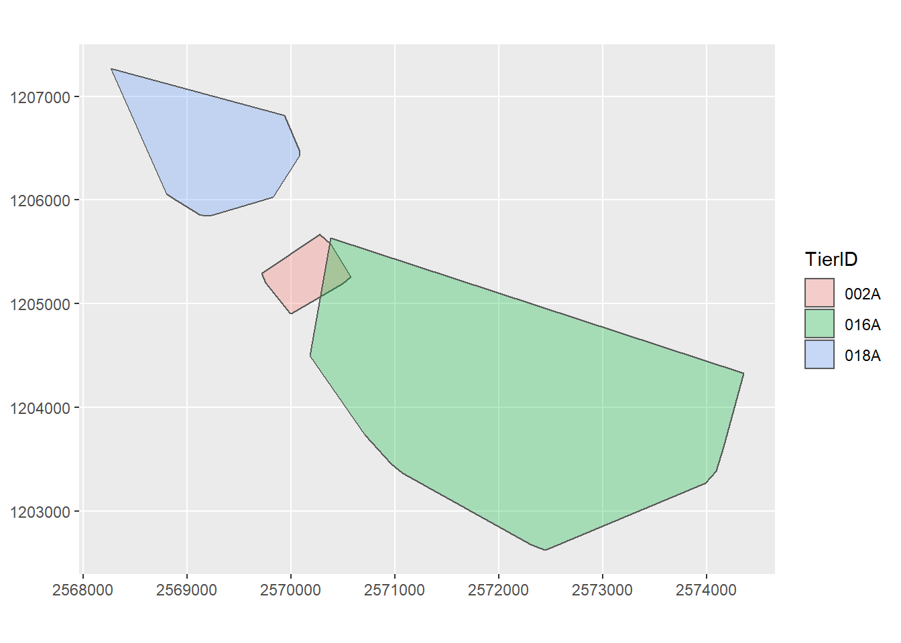
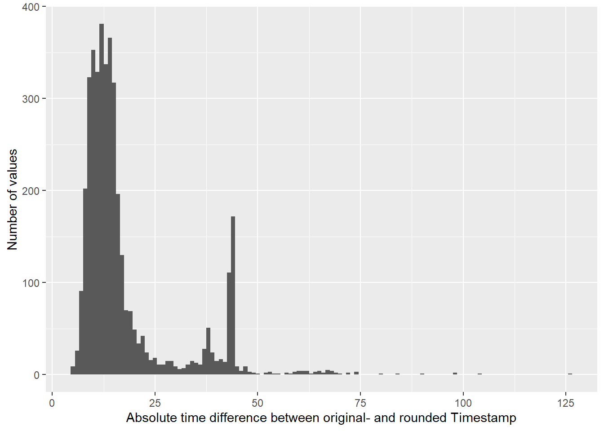

## Tasks and inputs


Up to now, we have used a variety of different functions designed by other developers. Sometimes we need to execute an operation multiple times, and most often it is reasonable to write a function to do so. Whenever you have copied and pasted a block of code more than twice, you should consider writing a function [@wickham2017]. 

We have violated this rule multiple times when calculating the Euclidean distances between points. Writing and rewriting the code `sqrt((x-lead(x,1))^2+(y-lead(y,1))^2)` over and over again is not only cumbersome, it is also error prone. We can easily wrap this operation into a function. This input on writing functions should bring you up to speed to do this in your first task.

The first step in writing a function, is picking a name and assigning `<- function(){}` to it.


```r
testfun <- function(){}
```

To run the function, we have to call the assigned name with the brackets. This function gives no output, which is why we get `NULL` back. 

```r
testfun()
```

```
## NULL
```

```r
class(testfun)
```

```
## [1] "function"
```

To make the function actually *do* something, we need to specify *what* should be done within the curly brackets `{}`. The following function always prints the same statement and accepts no input values:


```r
testfun <- function(){print("this function does nothing")}

testfun()
```

```
## [1] "this function does nothing"
```


If we want the function to accept some input values, we have to define them within the round brackets. For example, I specify a variable named `sometext` and can call this variable within the execution.


```r
testfun <- function(sometext){print(sometext)}

testfun(sometext = "this function does slightly more, but still not much")
```

```
## [1] "this function does slightly more, but still not much"
```

Let's take a more practical example. Say we want a function that calculates our age if provided with the date of our birthday. We can use `Sys.time()` to provide today's date and `difftime()` to calculate the time difference between today and our birthday.


```r
my_age <- function(birthday, units){
  difftime(Sys.time(),birthday, units = units)
  }

my_age(birthday = "1997-04-23", units = "days")
```

```
## Time difference of 8777.721 days
```

As we already know from using other functions, if we declare our variables in the order that we initially listed them, we do not need to specify the parameters (no need of `birthday = ` and `units =`).

```r
my_age("1997-04-23", "days")
```

```
## Time difference of 8777.721 days
```


If we want any of our parameters to have default value, we can assign an initial value to the parameter when declaring the variables within the round brackets.

```r
my_age <- function(birthday, units = "days"){
  difftime(Sys.time(),birthday, units = units)
  }

# if not stated otherwise, our function uses the unit "days"
my_age("1997-04-23")
```

```
## Time difference of 8777.721 days
```

```r
# We can still overwrite units
my_age("1997-04-23", "hours")
```

```
## Time difference of 210665.3 hours
```

All you need to do now is run execute the function deceleration (`myage <- function...` etc.) at the beginning of your script, and you can use the function for your entire R session. Tip: Always try to make your function self sufficient: Don't call variables that were created outside the function call.


### Task 1: Write your own functions

Create a function for our Euclidean distance calculation. 

Note: if you treat your input variables as vectors, they will work in `dplyr`s `mutate()` and `summarise()` operations. 


```r
euclid <- function(x,y,leadval = 1){
  sqrt((x-lead(x,leadval))^2+(y-lead(y,leadval))^2)
}
```


### Task 2: Filter data

We propose conceptualizing the pattern "meet" as "being close in space *and* time", with the notion "close" to be defined for the spatial and the temporal case separately. We will simplify the problem slightly so that we can use a number of R tools and data structures you now have learned to use by now. As a first simplification we propose manipulating the timestamps in such a way, that all observations are sampled concurrently, synchronously. This allows us using the data science concept *join* for detecting the temporal expression of meet - using `DateTimeUTC` as the key variable in a join statement: Observations with an identical time stamp will match. Once we have identified the temporal matches, we check if the concurrent observations are also close in space based on the Euclidean distances between concurrent positions.

Simplifying the task even further, we will focus on an interval where we have a continuous, small sampling interval over all our animals. So, filter your dataset to the time period 01.04.2015 - 15.04.2015) and save it to a new variable (e.g. `wildschwein_filter`). After filtering, visualize your data spatially. Just consider animals with a spatial overlap and remove animals where we cannot expect to find any meet patterns.


```r
library(sf)
```

```
## Warning: Paket 'sf' wurde unter R Version 4.0.5 erstellt
```

```
## Linking to GEOS 3.9.0, GDAL 3.2.1, PROJ 7.2.1
```

```r
library(readr)        
```

```
## Warning: Paket 'readr' wurde unter R Version 4.0.5 erstellt
```

```r
library(dplyr)        
```

```
## Warning: Paket 'dplyr' wurde unter R Version 4.0.5 erstellt
```

```
## 
## Attache Paket: 'dplyr'
```

```
## The following objects are masked from 'package:stats':
## 
##     filter, lag
```

```
## The following objects are masked from 'package:base':
## 
##     intersect, setdiff, setequal, union
```

```r
library(ggplot2)      
```

```
## Warning: Paket 'ggplot2' wurde unter R Version 4.0.5 erstellt
```

```r
library(sf)           
library(terra)        
```

```
## Warning: Paket 'terra' wurde unter R Version 4.0.5 erstellt
```

```
## terra version 1.1.17
```

```
## 
## Attache Paket: 'terra'
```

```
## The following objects are masked from 'package:dplyr':
## 
##     collapse, desc, near
```

```r
library(lubridate)
```

```
## Warning: Paket 'lubridate' wurde unter R Version 4.0.5 erstellt
```

```
## 
## Attache Paket: 'lubridate'
```

```
## The following objects are masked from 'package:terra':
## 
##     intersect, union
```

```
## The following objects are masked from 'package:base':
## 
##     date, intersect, setdiff, union
```

```r
wildschwein <- read_delim("00_Rawdata/wildschwein_BE_2056.csv",",")
```

```
## 
## -- Column specification --------------------------------------------------------
## cols(
##   TierID = col_character(),
##   TierName = col_character(),
##   CollarID = col_double(),
##   DatetimeUTC = col_datetime(format = ""),
##   E = col_double(),
##   N = col_double()
## )
```

```r
wildschwein_filter <- wildschwein %>%
  st_as_sf(coords = c("E", "N")) %>%
  dplyr::filter(DatetimeUTC > "2015-04-01",
         DatetimeUTC < "2015-04-15") 

wildschwein_filter %>%
  group_by(TierID) %>%
  summarise() %>%
  st_convex_hull() %>%
  ggplot() + geom_sf(aes(fill = TierID),alpha = 0.3)
```



```r
wildschwein_filter <- wildschwein_filter %>%
  filter(TierID != "018A")
```


### Task 3: Create Join Key

Have a look at your dataset. You will notice that samples are taken at every full hour, quarter past, half past and quarter to. The sampling time is usually off by a couple of seconds. Verify if we have the same sampling interval (`timelag`) throughout our filtered dataset.


```r
wildschwein_BE <- read_delim("00_Rawdata/wildschwein_BE_2056.csv",",")                                         
```

```
## 
## -- Column specification --------------------------------------------------------
## cols(
##   TierID = col_character(),
##   TierName = col_character(),
##   CollarID = col_double(),
##   DatetimeUTC = col_datetime(format = ""),
##   E = col_double(),
##   N = col_double()
## )
```

```r
wildschwein <- sf::st_as_sf(wildschwein_BE, coords = c("E", "N"), crs = 2056, remove = FALSE)


wildschwein_filter <- wildschwein %>%
  sf::st_as_sf(coords = c("E", "N")) %>% 
  dplyr::filter(DatetimeUTC > "2015-04-01",DatetimeUTC < "2015-04-15")


head(wildschwein_filter)
```

```
## Simple feature collection with 6 features and 6 fields
## Geometry type: POINT
## Dimension:     XY
## Bounding box:  xmin: 2570245 ymin: 1205259 xmax: 2570375 ymax: 1205320
## Projected CRS: CH1903+ / LV95
## # A tibble: 6 x 7
##   TierID TierName CollarID DatetimeUTC                E        N
##   <chr>  <chr>       <dbl> <dttm>                 <dbl>    <dbl>
## 1 002A   Sabi        12275 2015-03-31 22:00:28 2570296. 1205283.
## 2 002A   Sabi        12275 2015-03-31 22:15:44 2570259. 1205259.
## 3 002A   Sabi        12275 2015-03-31 22:30:44 2570255. 1205259.
## 4 002A   Sabi        12275 2015-03-31 22:46:04 2570245. 1205268.
## 5 002A   Sabi        12275 2015-03-31 23:00:17 2570364. 1205314.
## 6 002A   Sabi        12275 2015-03-31 23:15:12 2570375. 1205320.
## # ... with 1 more variable: geometry <POINT [m]>
```

```r
wildschwein_filter %>%
  mutate(timelag = difftime(lead(DatetimeUTC),DatetimeUTC,units = "mins")) %>%
  ggplot(aes(DatetimeUTC,timelag, colour = TierID)) +
  geom_line() +
  geom_point()+
  expand_limits(y = 0) +
  facet_grid(TierID~.)
```

```
## Don't know how to automatically pick scale for object of type difftime. Defaulting to continuous.
```

```
## Warning: Removed 1 row(s) containing missing values (geom_path).
```

```
## Warning: Removed 1 rows containing missing values (geom_point).
```


```r
wildschwein_filter <- wildschwein_filter %>%
  group_by(TierID) %>%
  mutate(
    DatetimeRound = lubridate::round_date(DatetimeUTC,"15 minutes")
  )

wildschwein_filter %>%
  mutate(delta = abs(as.integer(difftime(DatetimeUTC,DatetimeRound, units = "secs")))) %>%
  ggplot(aes(delta)) +
  geom_histogram(binwidth = 1) +
  labs(x = "Absolute time difference between original- and rounded Timestamp",
       y = "Number of values")
```



With a few exceptions, the sampling interval is *around* 15 minutes. In order to join the data, however, we need *identical* time stamps to serve as a join key. We therefore need to slightly adjust our time stamps to a common, concurrent interval. 

Round the minutes of `DatetimeUTC` to a multiple of 15 (00, 15, 30,45) and store the values in a new column[^interpolate]. You can use the  `lubridate` function `round_date()` for this. See the examples [here](https://lubridate.tidyverse.org/reference/round_date.html) to see how this goes.

[^interpolate]: *Please note:* We are manipulating our time stamps without adjusting the x,y-coordinates. This is fine for our simple example, but we would advice against this in a more serious research endeavour, e.g. in your semester projects. One simple approach would be to linearly interpolate the positions to the new timestamps. If you choose Option A the wild boar projects as your semester projects, you should aim for a linear interpolation. Get in touch if you need help with this.


### Task 4: Measuring distance at concurrent locations

To measure the distance between concurrent locations, we need to follow the following steps.

1. First, split the `wildschwein_filter` object into one `data.frame` per animal.[^1]
2. Next, join these datasets by the new, manipulated `Datetime` column and save it to the variable `wildschwein_join`. Which join-type is appropriate? The joined observations are *temporally close*.
3. On `wildschwein_join`, calculate Euclidean distances between concurrent observations. Store the values in a new column `distance`. 
4. Use a reasonable threshold on `distance` to determine if the animals are also *spatially close* enough to constitute a *meet* (we use 50 meters). Store this Boolean information (`TRUE`/`FALSE`) in a new column named `meet`.

[^1]: This is a perfect opportunity to learn functional programming if you are an intermediate to advanced programmer (or want to be). You can use `purrr::map()` specifically for these tasks. Ask us if you want to learn this but are struggling


```r
library(purrr)
```

```
## Warning: Paket 'purrr' wurde unter R Version 4.0.5 erstellt
```

```
## 
## Attache Paket: 'purrr'
```

```
## The following object is masked from 'package:terra':
## 
##     transpose
```

```r
wildschwein_join <- wildschwein_filter %>%
  ungroup() %>%
  dplyr::select(TierID,DatetimeRound,E,N) %>%
  st_set_geometry(NULL) %>%
  split(.$TierID) %>%
  accumulate(~full_join(.x,.y, by = "DatetimeRound")) %>%
  pluck(length(.))


euclid2 <- function(x1,y1,x2,y2){
  sqrt((x1-x2)^2+(y2-y2)^2)
}


wildschwein_join <- wildschwein_join %>%
  mutate(
    distance = euclid2(E.x,N.x,E.y,N.y),
    meet = distance < 100
  )


wildschwein_join
```

```
## # A tibble: 1,344 x 12
##    TierID.x DatetimeRound            E.x     N.x TierID.y     E.y     N.y TierID
##    <chr>    <dttm>                 <dbl>   <dbl> <chr>      <dbl>   <dbl> <chr> 
##  1 002A     2015-03-31 22:00:00 2570296.  1.21e6 016A      2.57e6  1.20e6 018A  
##  2 002A     2015-03-31 22:15:00 2570259.  1.21e6 016A      2.57e6  1.20e6 018A  
##  3 002A     2015-03-31 22:30:00 2570255.  1.21e6 016A      2.57e6  1.20e6 018A  
##  4 002A     2015-03-31 22:45:00 2570245.  1.21e6 016A      2.57e6  1.20e6 018A  
##  5 002A     2015-03-31 23:00:00 2570364.  1.21e6 016A      2.57e6  1.20e6 018A  
##  6 002A     2015-03-31 23:15:00 2570375.  1.21e6 016A      2.57e6  1.20e6 018A  
##  7 002A     2015-03-31 23:30:00 2570411.  1.21e6 016A      2.57e6  1.20e6 018A  
##  8 002A     2015-03-31 23:45:00 2570429.  1.21e6 016A      2.57e6  1.20e6 018A  
##  9 002A     2015-04-01 00:00:00 2570372.  1.21e6 016A      2.57e6  1.20e6 018A  
## 10 002A     2015-04-01 00:15:00 2570309.  1.21e6 016A      2.57e6  1.20e6 018A  
## # ... with 1,334 more rows, and 4 more variables: E <dbl>, N <dbl>,
## #   distance <dbl>, meet <lgl>
```


### Task 5: Visualize data

Now, visualize the *meets* spatially in a way that you think reasonable. You can attempt to recreate the plot below, but this is not trivial. If you want to try it, these are the steps to take:

Create a new dataset (e.g. `wildschwein_meet`) as follows:

1. Using the `cumsum()`approach from last week, create a new column (e.g. `meet_seq`) enumerating the "meets" with individual ID (see proposed function below)
2. Filter all rows where the animals _did_ meet. 
3. Optional: create a column with the start- and endtime of each meet (e.g. `meet_time`)

To create a plot similar to the one below:

1. Initiate a `ggplot()` with the `wildschwein_join` dataset.
2. Add two `geom_point`-layers (not `geom_sf`, since we haven't turned `wildschwein_join` into an `sf`object), one referring to E.x/N.x, the other to E.y/N.y
3. Add two more `geom_point`-layers, this time with the dataset `wildschwein_meet`
4. Facet the plot into small multiples either using `meet_seq` or `meet_time`


```r
# library(ggpmisc)
# 
# pk25 <- brick("../CMA_FS2018_Filestorage/pk25.tif")
# swissimage <- brick("../CMA_FS2018_Filestorage/swissimage_250cm.tif")

number_seq = function(bool){
  fac <- as.factor(ifelse(bool,1+cumsum(!bool),NA))
  levels(fac) <- 1:length(levels(fac))
  return(fac)
}


library(lwgeom)
```

```
## Linking to liblwgeom 3.0.0beta1 r16016, GEOS 3.8.0, PROJ 6.3.1
```

```
## Warning in fun(libname, pkgname): GEOS versions differ: lwgeom has 3.8.0 sf has
## 3.9.0
```

```
## Warning in fun(libname, pkgname): PROJ versions differ: lwgeom has 6.3.1 sf has
## 7.2.1
```

```r
wildschwein_spread <- wildschwein_join %>%
  mutate(meet_seq = number_seq(meet)) %>% 
  tidyr::gather(key,val, contains(".")) %>%
  tidyr::separate(key,into = c("key","animal")) %>%
  tidyr::spread(key,val,convert = T) %>%
  arrange(TierID,DatetimeRound) %>%
  st_as_sf(coords = c("E","N"),remove = F) %>%
  st_set_crs(2056) 

meets <- wildschwein_spread %>%
  dplyr::filter(meet) %>%
  group_by(meet_seq) %>%
  summarise(
    start = min(DatetimeRound),
    end = max(DatetimeRound)
  ) %>%
  mutate(name = paste(meet_seq,":",start,"-",strftime(end,format = "%H:%M:%S"))) %>%
  st_minimum_bounding_circle()

ggplot(wildschwein_spread) +
  geom_point(aes(E,N,colour = TierID),alpha = 0.2) +
  geom_path(aes(E,N,colour = TierID),alpha = 0.2) +
  geom_sf(data = meets, alpha = 0.3, fill = "green") +
  facet_wrap(~name, ncol = 2) +
  coord_sf(datum = 2056) +
  theme_light() +
  theme(axis.title = element_blank()) +
  labs(title = paste("The",nrow(meets),"meet events of the two animals"), subtitle = "Using a threshold of 100 meters")
```


### Task 6 (optional): Visualize data as timecube with `plotly`

Finally, you can nicely visualize the meeting patterns and trajectories in a Space-Time-Cube [@hagerstraand1970] with the package `plotly`. There are some [nice ressources](https://plot.ly/r/3d-line-plots/) available online.


```r
# library(ggpmisc)
# 
# pk25 <- brick("../CMA_FS2018_Filestorage/pk25.tif")
# swissimage <- brick("../CMA_FS2018_Filestorage/swissimage_250cm.tif")

number_seq = function(bool){
  fac <- as.factor(ifelse(bool,1+cumsum(!bool),NA))
  levels(fac) <- 1:length(levels(fac))
  return(fac)
}


library(lwgeom)

wildschwein_spread <- wildschwein_join %>%
  mutate(meet_seq = number_seq(meet)) %>% 
  tidyr::gather(key,val, contains(".")) %>%
  tidyr::separate(key,into = c("key","animal")) %>%
  tidyr::spread(key,val,convert = T) %>%
  arrange(TierID,DatetimeRound) %>%
  st_as_sf(coords = c("E","N"),remove = F) %>%
  st_set_crs(2056) 

meets <- wildschwein_spread %>%
  dplyr::filter(meet) %>%
  group_by(meet_seq) %>%
  summarise(
    start = min(DatetimeRound),
    end = max(DatetimeRound)
  ) %>%
  mutate(name = paste(meet_seq,":",start,"-",strftime(end,format = "%H:%M:%S"))) %>%
  st_minimum_bounding_circle()

ggplot(wildschwein_spread) +
  geom_point(aes(E,N,colour = TierID),alpha = 0.2) +
  geom_path(aes(E,N,colour = TierID),alpha = 0.2) +
  geom_sf(data = meets, alpha = 0.3, fill = "green") +
  facet_wrap(~name, ncol = 2) +
  coord_sf(datum = 2056) +
  theme_light() +
  theme(axis.title = element_blank()) +
  labs(title = paste("The",nrow(meets),"meet events of the two animals"), subtitle = "Using a threshold of 100 meters")
```


