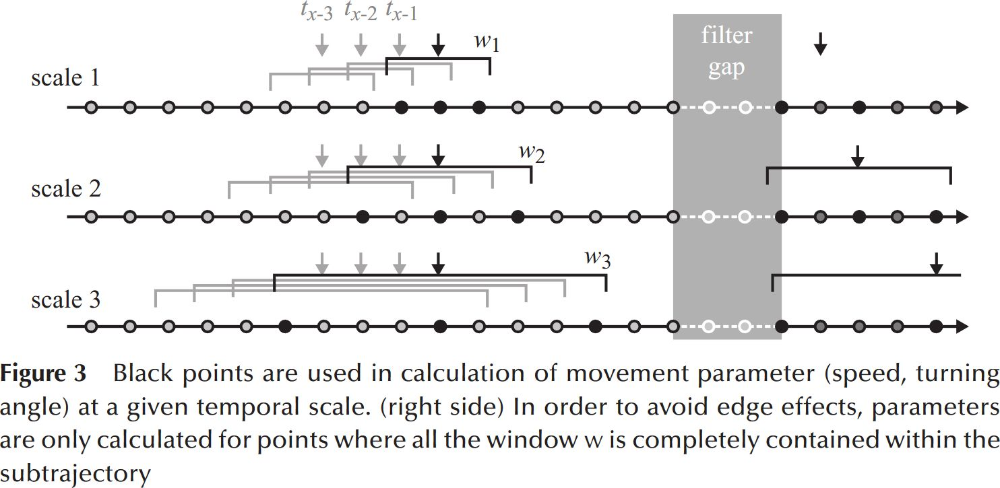

```{r include=FALSE}
knitr::opts_chunk$set(echo = F)
knitr::opts_chunk$set(include = F)
knitr::opts_chunk$set(eval = T)

knitr::opts_chunk$set(purl = T)

knitr::opts_chunk$set(collapse = T)
knitr::opts_chunk$set(warning = F)
knitr::opts_chunk$set(message = F)


# include = FALSE prevents code and results from appearing in the finished file. R Markdown still runs the code in the chunk, and the results can be used by other chunks.

# echo = FALSE prevents code, but not the results from appearing in the finished file. This is a useful way to embed figures.

# message = FALSE prevents messages that are generated by code from appearing in the finished file.

# warning = FALSE prevents warnings that are generated by code from appearing in the finished.

# fig.cap = "..." adds a caption to graphical results.

# See the R Markdown Reference Guide for a complete list of knitr chunk options.
# https://www.rstudio.com/wp-content/uploads/2015/03/rmarkdown-reference.pdf
```

```{r}
# Allow duplicate Labels so that calling purl() does not create an error
# https://stackoverflow.com/q/36868287/4139249
# options(knitr.duplicate.label = 'allow')

# purl all Rmd Documents (with some exceptions) and store them in a Subfolder /RFiles
# Document cannot be knitted if the folder "RFiles" does not exist!

options(knitr.duplicate.label = 'allow')

library(stringr)

rmds <- list.files(pattern = "\\.Rmd",recursive = T)

exclude <- c("_Rcode","99_","index","Archive","Admin","_main","project_ideas","RFiles","patterns-and-trends")

rmds <- rmds[-grep(paste(exclude,collapse="|"),ignore.case = TRUE, rmds, value=F)]

for (file in rmds){
  file_r <- paste0(str_split_fixed(file,"\\.",2)[1],"_code.R",collapse = "")
  file_r <- str_split_fixed(file_r,"/",Inf)   # split path at /
  file_r <- append(file_r, "RFiles",length(file_r)-1)# append Foldername
  file_r <- paste(file_r,collapse = "/")    # collapse vector to string
  if(file.exists(file_r)){
    file.remove(file_r)
  }
  knitr::purl(file,documentation = 0,output = file_r)
  

}
 
```


# Introduction Chapter {-}

For our practical `R` course building-up skills for analyzing movement data in the software environment `R`, you'll be using data from the ZHAW project ["Prävention von Wildschweinschäden in der Landwirtschaft"](https://www.zhaw.ch/de/lsfm/institute-zentren/iunr/integrative-oekologie/wildtiermanagement/referenzprojekte/).

The project investigates the spatiotemporal movement patterns of wild boar (*Sus scrofa*) in agricultural landscapes. We will study the trajectories of these wild boar, practicing the most basic analysis tasks of Computational Movement Analysis (CMA). 

**Please note:** we are given application data from an ongoing research project. Capturing wild living animals and then equipping them with GPS collars is a very labor and cost intensive form of research. Consequently, data resulting such campaigns is a very valuable asset that must be protected. So, please do not pass on this data, for any use beyond this module contact Patrick Laube or the data owner Stefan Suter (suts@zhaw.ch).


<!--chapter:end:index.Rmd-->

# Exercise 1
<!-- '- Set up Rstudio Project -->
<!-- - Import and clean data -->
<!-- - Explore Dataset: remove outliers, find sampling interval, make subsets and find overlapping areas of individuals) -->
<!-- - Make my first simple map -->

Exercise 1 covers the necessary steps for getting ready in `R` and some basic concepts for setting up a well-structured `R` project. The lesson introduces how additional packages that provide useful functions for data science are made available and how spatial data is handled. The exercise concludes with the creation of your first map featuring movement data.


## Leaning outcomes
- You learn how to structure an `R` project.
- You can read movement data from a .csv-file into a `data.frame`
- You can convert spatial point data from a `data.frame` to a spatial object `sf`
- You can perform basic spatial operations on spatial objects in `R`
- You can produce simple maps of your spatial data using `ggplot2`
- You can produce simple maps of your spatial data using `tmap`


## Prerequisites
Readings Skills from "R for Data Science" [@wickham2017]:

- RS1.1 Preface (16p, ix-xxiv)
- RS1.2 Chap2 Workflow basics (3p, 37-39)
- RS1.3 Chap4 Workflow scripts (3p, 77-79)
- RS1.4 Chap6 workflow projects (6p, 111-116)
- RS1.5 Chap8 Data Import with `readr` (21p)
- RS1.6 Chap13 Date and Times with `lubridate` (18p, 237-256)


## Preperation
If you haven't already, install the packages `tidyverse`, `sf`, `raster` and `ggspatial`(using `install.packages()`). **Restart your `R` session after installing all these packages.**

```{r, echo = T, include=T,eval = F, purl = F}
install.packages("tidyverse")
install.packages("sf")
install.packages("raster")
```

## Tasks and inputs

### Task 1: Initialize project

Create a new *RStudio Project*. As recommended in @wickham2017, remove the option "*Restore .RData into workspace at startup*" and set the option "*save workspace to .RData on exit*" to "*Never*".

Create a new .R (or .Rmd) File and divide it into the sections necessary in a classical Data Science Workflow. In .R Files, "Sections" can be created within RStudio by adding Comments (`#`) with at least 4 trailing dashes, equal, or pound signs ( `-`, `=`,`#`). In .Rmd Files, their are created with leading pound signs (`#`).

Sections allow code folding (try clicking on the small triangle next to the line number) and facilitate navigation (try the shortcut: `Shift`+`Alt`+`J`). We recommend following sections:

- Loading environment / libraries
- Data import
- Data cleansing
- Data analysis and visualization


```{r}

## Task 1 ######################################################################
```

```{r}
# Loading enironment / libraries ####
library(tidyverse)


# Data import ####

# Data clensing ####

# Data analysis and visualization ####

```


### Task 2: Import data
```{r}
## Task 2 ######################################################################
```
In section "data import", import the file `wildschwein_BE.csv`. Obtain this file from moodle.

Note: 

- If your are using [a graphical tool](https://support.rstudio.com/hc/en-us/articles/218611977-Importing-Data-with-RStudio) to import your code, make sure you save the corresponding code in your R Script. This is important in regard to the reproducibility of your script and will ensure that your workflow is documented without gaps. We'd rather recommend to move away from using graphical tools and focus on using code. 
- We recommend using one of the `tidyverse` functions from the `readr` package to import your data (they all begin with "`read_*`, note the underscore). These functions are less error prone than the base `R` functions (`read.*`). Specifically for the wild boar data, we recommend `read_delim()`.
- If you use `read_delim()` and receive warnings during import, have a look at these warnings by using the function `problems()`. Resolve these problems until import runs without warnings.
- Assign correct data types as necessary and make sure the time zone is set correctly for the date/time column.
- For everyone working on the RStudio Server: You will first need to upload this data to the server using the "*upload*"-button in the "*Files*" tab.


```{r}
# Data import ####
wildschwein_BE <- read_delim("00_Rawdata/wildschwein_BE.csv",",")


# Check Timezone
attr(wildschwein_BE$DatetimeUTC,"tzone") # or
wildschwein_BE$DatetimeUTC[1]
```


### Task 3: Explore Data
```{r}
## Task 3 ######################################################################
```
We will use a range of different visualization tools (i.e. R-packages) in this course. Several packages techniques have emerged in recent years, each with their specific strengths and weaknesses. While `base::plot() `is quick and simple, it not very scalable with growing complexity. `ggplot2` offers solutions for most use cases and has an elegant, consistent syntax that is easy to get accustomed to. We will get to know other techniques later in the course.

Get an overview of your data by creating a first "map-like" plot of your data producing a simple scatter plot with `ggplot2`. 
Setting up a `ggplot` with our data is done using the command `ggplot(wildschwein_BE, aes(Long, Lat, colour = TierID))`. Creating a map is done via the basic scatter plot command `geom_point()`.
<!-- Use `coord_map()` to get a reasonable aspect ratio of `Lat` and `Long`. -->
Assigning every individual its own colour is done using the `ggplot` argument `colour =`.

Save your code in the appropriate section.


```{r echo = F, include=T, eval = T, }

ggplot(wildschwein_BE, aes(Long,Lat, colour = TierID)) +
  geom_point() +
  theme(legend.position = "none")
```


### Input: Handling spatial data
```{r}
## Input Handling Spatial Data #################################################
```
Until now, we've stored our location data within data frames as Lat/Long columns. This works well for many tasks, but sometimes we need special *spatial* classes to handle our trajectories. We will get to know such cases in our next tasks, but first we need to convert our `data.frame` into a spatial object.
Some of you might be familiar with the `sp` package with the classes `SpatialPoints`, `SpatialPointsDataFrame` and so on. These packages are mostly replaced by the fairly new package `sf`. This packages has some huge advantages over `sp`:

- simple features are essentially data frames with minor extensions and thus are easily integratable in standard workflows
- they are programmed to cleanly interface with the `tidyverse` methods (specifically `dplyr`'s `mutate` and `summarise`)
- comply with the common Open Geospatial Consortium (OGC) standards (ISO 19125-1:2004) and interface with other important spatial tools such as GDAL, PostGIS, GeoJSON and so fourth
- are being rapidly implemented in visualisation tools such as `ggplot2`, `plotly` and `tmap`


We will largely rely on `sf`when working with vector data in `R`. In order to transform our `data.frame` into an sf object, we need to use the function `st_as_sf()` while specifying the columns storing the coordinates and the coordinate reference system[^10].

[^10]: At this point, we assume you know what a Coordinate Reference Systems is. Check out [this link](https://earthdatascience.org/courses/earth-analytics/spatial-data-r/intro-to-coordinate-reference-systems/) if this is not the case. 


```{r input_handlingSpatialData, echo = T, include = T, eval = T}

library(sf)

wildschwein_BE_sf <- st_as_sf(wildschwein_BE, 
                              coords = c("Long", "Lat"), 
                              crs = 4326)

```

Notice how `st_as_sf` takes the EPSG code for the `crs =` argument. This is so much easier and more elegant than using `PROJ.4` or `WKT`. You can find a lot of useful information on Coordinate Reference Systems (including EPSG Codes , etc.) under [spatialreference.org](http://spatialreference.org/ref/epsg/2056/) or http://epsg.io.  

Let's compare our original `data.frame` with this new `sf` object:

```{r,  echo = T, include = T, eval = T, collapse=F}
wildschwein_BE

wildschwein_BE_sf
```

As you can see, `st_as_sf()` has added some metadata to our dataframe (`geometry type`, `dimension`, `bbox`, `epsg` and `proj4string`) and replaced the columns `Lat` and `Long` with a column named `geometry`. Other than that, the new `sf` object is very similar to our original dataframe. In fact, `sf` objects *are* essentially `dataframes`, just ask `R`:

```{r,  echo = T, include = T, eval = T, purl = F}
is.data.frame(wildschwein_BE_sf)
```

All operations we know from handling `data.frames` can be used on the `sf` object. Try some out!
```{r,  echo = T, include = T, eval = F, purl = F}
# subset rows
wildschwein_BE_sf[1:10,]
wildschwein_BE_sf[wildschwein_BE_sf$TierName == "Sabi",]

# subset colums
wildschwein_BE_sf[,2:3]
```

Instead of keeping the same data twice (once as a `data.frame`, and once as an `sf` object), we will overwrite the `data.frame` and continue working with the `sf` object from now on. This saves some memory space in `R` and avoids confusion. 

```{r,  echo = T, include = T, eval = T}
wildschwein_BE = st_as_sf(wildschwein_BE, 
                          coords = c("Long", "Lat"), 
                          crs = 4326)

rm(wildschwein_BE_sf) 
# we can remove this sf object, since it just eats up our memory

```


### Task 4: Project data from WGS84
```{r}
## Task 4 ######################################################################
```
So what can we do with our new `sf` object that we couldn't before? One example is projecting the WGS84 (`Lat`/`Long`) coordinates into the new Swiss CRS `CH1903+ LV95`[^50]. Do this by using the function `st_transform`. By the way, do you notice a pattern here? The package `sf` names most functions for spatial operations with the prefix `st_*`, just as in PostGIS.

[^50]: As we've mentioned in the first Input, you can look up the EPSG codes under [spatialreference.org](http://spatialreference.org/ref/epsg/2056/) or http://epsg.io. For information specific to Switzerland, check the [swisstopo website](https://www.swisstopo.admin.ch/en/knowledge-facts/surveying-geodesy/reference-systems.html) 


```{r}

wildschwein_BE <- st_transform(wildschwein_BE, 2056)


```

Here's the resulting `sf` object from the operation:
```{r, echo = F, include=T,eval = T}
wildschwein_BE
```


### Input: Calculate Convex Hull
```{r}
## Input: Calculate Convex Hull ################################################
```
Transforming from one Coordinate Reference System to another was one operation where we needed an object with a spatial nature. In this way, we were able to use an off the shelf function to project the coordinates from one CRS to another. In our next example, we again rely on a spatial function: We want to calculate a [convex hull](https://en.wikipedia.org/wiki/Convex_hull) per Wild boar. And guess what the function for calculating a convex hull is called in `sf`? If you guessed `st_convex_hull()`, you were right! 

By default `st_convex_hull()` calculates the convex hull *per feature*, i.e. *per point* in our dataset. This of course makes little sense. In order to calculate the convex hull per animal, we need to convert our point- to multipoint-features where each feature contains all positions of one animal. This is achieved in two steps:

First: add a grouping variable to the `sf` object. Note the new grouping variable in the metadata of the `sf` object. Other than that, `group_by` has no effect on our `sf` object.


```{r input_calculateConvexHull, echo = T,include = T,eval = T}

wildschwein_BE_grouped <- group_by(wildschwein_BE,TierID)

wildschwein_BE_grouped

```


Second: use `summarise()` to "dissolve" all points into a mulipoint object. 

```{r, echo = T,include = T,eval = T}
wildschwein_BE_smry <- summarise(wildschwein_BE_grouped)

wildschwein_BE_smry

```


Now we can run `st_convex_hull` on the new `sf` object. 

```{r, echo = T,include = T,eval = T}
mcp <- st_convex_hull(wildschwein_BE_smry)

```


### Task 5: Ploting spatial objects
```{r}
## Task 5 ######################################################################
```
Using base plot to visualize `sf` objects is easy enough, just try the following code. 


```{r echo = T,include = T,eval = T}
plot(mcp)
```

But since we use `ggplot` extensively, try and plot the object `mcp` with `ggplot`. Hint: Use the layer `geom_sf()` to add an `sf` object.

```{r, echo = F,include = T,eval = T}
ggplot(mcp,aes(fill = TierID)) +
  geom_sf(alpha = 0.4)
```

Note: `ggplot` refuses to use our specified CRS, so we need to force this by specifying `datum = ` in `coord_sf()`. Try it out.


```{r, echo = F,include = T,eval = T}
ggplot(mcp,aes(fill = TierID)) +
  geom_sf(alpha = 0.4) +
  coord_sf(datum = 2056)
```


### Input: Importing raster data
```{r}
## Input: Importing Raster Data ################################################
```
In the next task, we would like to add a background map to our `mcp` object. To do this, we have to the raster data into `R` first. For this, we use the package `raster` with the function `brick`.


```{r echo = T,include = T,eval = T}

library(raster)

pk100_BE <- brick("00_Rawdata/pk100_BE_2056.tif")

pk100_BE
```


`pk100_BE_2056.tif` is a three layered geotiff File. The above console output shows some metadata including the resolution, extent and the names of our layers (`pk100_BE_2056.1`, `pk100_BE_2056.2`etc). For some reason, `RasterBrick` imported a fourth layer (`pk100_BE_2056.4`). `plot()` shows that the fourth layer is empty. We will remove this layer using `subset()`. 

```{r, echo = T,include = T,eval = T}

plot(pk100_BE)

pk100_BE <- subset(pk100_BE,1:3)

plot(pk100_BE)

```


### Task 6: Adding a background map
```{r}
## Task 6 ######################################################################
```
There are multiple ways to add a background map in `ggplot`, many require additional packages. This is a good opportunity to get to know a completely different package for creating maps: `tmap` ("thematic map"). This package was developed with a syntax very similar to `ggplot2`, which makes it easy to learn.


```{r task6, echo = T,include = T,eval = T}
library(tmap)


tm_shape(pk100_BE) + 
  tm_rgb() 

```

As you can see, plotting layers in `tmap` is combined with the `+` sign, just as in `ggplot2`. In `tmap` however, each layer consists of two objects: a `tm_shape()` in which the data is called, and a `tm_*` object in which we define how the data is visualized (`tm_rgb()` states that it is plotted as an RGB Raster Layer). Add the object `mcp` to the plot in this manner. Read [the vignette](https://cran.r-project.org/web/packages/tmap/vignettes/tmap-getstarted.html) if you are having trouble.

```{r, echo = F,include = T,eval = T}
tm_shape(pk100_BE) + 
  tm_rgb() +
  tm_shape(mcp) +
  tm_polygons(col = "TierID",alpha = 0.4,border.col = "red") +
  tm_legend(bg.color = "white")


```


### Task 7: Create an interactive map

```{r}
## Task 7 ######################################################################
```

Rerun the `tmap()...` command from the previous task, but switch the plotting mode to "view"" (`tmap_mode("view")`) beforehand. Omit the raster layer (`pk100_BE`), you won't be needing it.


```{r task7, echo = F,include = T,eval = F}

tmap_mode("view")

tm_shape(mcp) +
  tm_polygons(col = "TierID",alpha = 0.4,border.col = "red") +
  tm_legend(bg.color = "white")
```

<!--chapter:end:11_Week1/W01_01_Exercise.Rmd-->

# Exercise 2

## Learning Outcomes
- You understand the dplyr functions `mutate`, `summarise` and `group_by` and can apply them to `sf` objects
- You can derive movement parameters (`timelag`, `steplength`, `speed`) from trajectory data.
- You can re-sample your trajectory data for cross-scale movement analysis. 

## Prerequisites
Readings Skills from "R for Data Science" [@wickham2017]:

- RS2.1 Chap3 Data Transformation with `dplyr` (31p, 43-76)
- RS2.2 Chap10 Relational data with `dplyr` (21p, 171-193)
- RS2.3 Chap14 Pipes with `magrittr` (6p, 261-268)

Readings Theory

- R2.1 @laube2011: How fast is a cow? cross - scale analysis of movement data.

## Preperation

```{r}
## Preperation #################################################################
```


Install the package `zoo` to get access to the rolling window functions for last exercise. 


```{r, echo = T, include = T, eval = F, purl = F}
install.packages("zoo")

```


Import the wild boar data and convert it to an `sf` object with CH1903+ LV95 Coordinates. Either run your own script from last week or the following lines to bring the data to the form we need it for today exercise.

```{r, echo = T, include = T, eval = T}
library(tidyverse)
library(sf)
library(lubridate)

wildschwein_BE <- read_delim("00_Rawdata/wildschwein_BE.csv",",")

wildschwein_BE = st_as_sf(wildschwein_BE, 
                          coords = c("Long", "Lat"), 
                          crs = 4326)

wildschwein_BE <- st_transform(wildschwein_BE, 2056)
```

## Demo Tidyverse
```{r}
## Demo Tidyverse ##############################################################
```

Depending on your knowledge of `R`, getting an overview of the data we imported last week might have been quite a challenge. Surprisingly enough, importing, cleaning and exploring your data can be the most challenging, time consuming part of a project. RStudio and the tidyverse offer many helpful tools to make this part easier (and more fun). You have read chapters on `dplyr` and `magrittr` as a preparation for this exercise. Before we start with the exercise however, this demo illustrates a simple approach offered by tidyverse which is applicable to sf-objects.

Assume we want to calculate the timelag between subsequent positions. To achieve this we can use the function `difftime()` combined with `lead()` from `dplyr`. Let's look at these functions one by one.

### `difftime`

`difftime` takes two `POSIXct` values.


```{r, echo = T, include = T, eval = T}
now <- Sys.time()

later <- now + 10000

time_difference <- difftime(later,now)
```


```{r}
time_difference
```

You can also specify the unit of the output.

```{r, echo = T, include = T, eval = T}
time_difference <- difftime(later,now,units = "mins")
```

```{r}
time_difference
```


`difftime` returns an object of the Class `difftime`. However in our case, numeric values would be more handy than the Class `difftime`. So we'll wrap the command in `as.numeric()`:
```{r, echo = T, include = T, eval = T}
str(time_difference)
```


```{r, echo = T, include = T, eval = T}
time_difference <- as.numeric(difftime(later,now,units = "mins"))

str(time_difference)

```

### `lead()` / `lag()`


`lead()` and `lag()` return a vector of the same length as the input, just offset by a specific number of values (default is 1). Consider the following sequence:

```{r, echo = T, include = T, eval = T}
numbers <- 1:10

numbers
```

We can now run `lead()` and `lag()` on this sequence to illustrate the output. `n =` specifies the offset, `default =` specifies the default value used to "fill" the emerging "empty spaces" of the vector.

```{r, echo = T, include = T, eval = T}
lead(numbers)

lead(numbers,n = 2)

lag(numbers)

lag(numbers,n = 5)

lag(numbers,n = 5, default = 0)
```

This helps us performing operations on subsequent values in a vector (or rows in a table). You can think of this a little bit like a moving temporal window that moves along the trajectory, or down the rows of a table respectively.

```{r}
lead(numbers)-numbers
```


### `mutate()`
Using the above functions (`difftime()` and `lead()`), we can calculate the time lag, that is, the time difference between subsequent positions:

```{r, echo = T, include = T, eval = T}

wildschwein_BE$timelag  <- as.numeric(difftime(lead(wildschwein_BE$DatetimeUTC),
                                               wildschwein_BE$DatetimeUTC,
                                               units = "secs"))

```

We mention `wildschwein_BE` three times in this function, which is complicated. Instead, we can use `mutate()` to simplify the syntax:

```{r, echo = T, include = T, eval = T}
wildschwein_BE <- mutate(wildschwein_BE,timelag = as.numeric(difftime(lead(DatetimeUTC),
                                                                      DatetimeUTC,
                                                                      units = "secs")))
```


### `group_by()`

Now let's have a look at the vector created before:
```{r, echo = T, include = T, eval = T}
summary(wildschwein_BE$timelag)
```

These values don't make much sense: some are negative (which should not be the case) and some are very high (which would indicate large data gaps and should not be the case either). The reason for this result is that we did not consider that `timelag` should just be calculated between subsequent rows *of the same individual*. We can implement this by using `group_by()` (just as if calculating the convex hull last week). 

```{r, echo = T, include = T, eval = T}
wildschwein_BE <- group_by(wildschwein_BE,TierID)
```

After adding this grouping variable, calculating the timelag automatically accounts for the individual trajectories.

```{r, echo = T, include = T, eval = T}
wildschwein_BE <- mutate(wildschwein_BE,timelag = as.numeric(difftime(lead(DatetimeUTC),
                                                                      DatetimeUTC,
                                                                      units = "secs")))

summary(wildschwein_BE$timelag)
```


### `summarise()`

`summary()` returned the metrics over all individuals. If we want to summarise our data and get metrics *per animal*, we can use the `dplyr` function `summarise()`. In contrast to `mutate()`, which just adds a new column to the dataset, `summarise()` "collapses" the data to one row per individual (specified by `group_by`).

```{r,, echo = T, eval = F, include= T}
summarise(wildschwein_BE, mean = mean(timelag, na.rm = T))
```

The above operation works fine on normal `data.frames`, but since `wildschwein_BE` is also an `sf` object, `summarise` actually merges all the points to a multipoint geometry, which takes a long time to calculate. In order to prevent this, we can set the objects geometry to `NULL`, which removes the spatial attribute.
```{r, echo = T, include = T, eval = T}

summarise(st_set_geometry(wildschwein_BE,NULL), mean_timelag = mean(timelag, na.rm = T))
```


### Piping 
The code above may be a bit hard to read, since it has so many nested functions which need to be read from the inside out. In order to make code readable in a more human-friendly way, we can use the piping command `%>%` from `magrittr`, which is included in `dplyr` and the `tidyverse`. The above code then looks like this:

```{r, echo = T, include = T, eval = T}

wildschwein_BE %>%                     # Take wildschwein_BE...
  st_set_geometry(NULL) %>%            # ...remove the geometry column...
  group_by(TierID) %>%                 # ...group it by TierID
  summarise(                           # Summarise the data...
    mean_timelag = mean(timelag,na.rm = T) # ...by calculating the mean timelag
  )
```


### Bring it all together...

Here is the same approach with a different, smaller dataset:

```{r, echo = T, include = T, eval = T}
pigs = data.frame(
  TierID=c(8001,8003,8004,8005,8800,8820,3000,3001,3002,3003,8330,7222),
  sex=c("M","M","M","F","M","M","F","F","M","F","M","F"),
  age=c("A","A","J","A","J","J","J","A","J","J","A","A"),
  weight=c(50.755,43.409,12.000,16.787,20.987,25.765,22.0122,21.343,12.532,54.32,11.027,88.08)
)

pigs

pigs %>%
    summarise(         
    mean_weight = mean(weight)
  )

pigs %>%
  group_by(sex) %>%
  summarise(         
    mean_weight = mean(weight)
  )

pigs %>%
  group_by(sex,age) %>%
  summarise(         
    mean_weight = mean(weight)
  )

```


## Tasks and Inputs

### Task 1: Getting an overview
```{r}
## Task 1 ######################################################################
```

Calculate the time difference between subsequent rows as described in the demo (column `timelag`).
First, inspect your data in more detail. Try to answer the following questions:

- How many individuals were tracked? 
- For how long were the individual tracked? Are there gaps?
- Were all individuals tracked concurrently or sequentially? 
- What is the temporal sampling interval between the locations?


Here are some exemplary visualisation you could produce to answer these questions. Can you now answer the above questions?

```{r, echo = F, include=T, eval = T}


wildschwein_BE <- wildschwein_BE %>%
  mutate(timelag = as.numeric(difftime(lead(DatetimeUTC),
                                       DatetimeUTC,
                                       units = "secs")))

ggplot(wildschwein_BE, aes(DatetimeUTC,TierID)) +
  geom_line()

ggplot(wildschwein_BE, aes(timelag)) +
  geom_histogram(binwidth = 50) +
  lims(x = c(0,15000)) +
  scale_y_log10()
  

wildschwein_BE %>%
  filter(year(DatetimeUTC)  == 2014) %>%
  ggplot(aes(DatetimeUTC,timelag, colour = TierID)) +
  geom_line() +
  geom_point()
  


```


### Input: Geometry as columns
```{r}
## Input: Geometry as Columns ##################################################
```


Last week, we transformed our data from a `data.frame` to an `sf` object. This turned our `Lat`/`Long` columns into a single geometry (list) column. While this is very handy for many spatial operations, accessing the coordinates directly becomes difficult. We therefore suggest storing the information twice, once as a geometry and once as a numeric value. To do this, we have to extract the Coordinates using `st_coordinates()`. We can store these values in a new variable and display them:

```{r, echo = T, eval = T, include=T}
# Store coordinates in a new variable

coordinates <- st_coordinates(wildschwein_BE)

head(coordinates)
```

Note that that the column are named `X` and `Y`, while [`CH1903+ LV95`](https://www.swisstopo.admin.ch/de/wissen-fakten/geodaesie-vermessung/neue-koordinaten.html) names the Axes `E` and `N`: let's rename the columns appropriately. After this, we can use `cbind()` to "glue" the columns to our original `sf`-object.

```{r, echo = T, eval = T, include=T}
colnames(coordinates) <- c("E","N")

wildschwein_BE <- cbind(wildschwein_BE,coordinates)

head(wildschwein_BE)
```

```{r}
#- chunkend
```

### Task 2: Deriving movement parameters I: Speed

```{r}
## Task 2 ######################################################################
```

In this task we will derive some additional movement parameters from our trajectories. So far our trajectories only consist of a list of time-stamped spatial locations. So let's calculate the animal's steplength based on the Euclidean distance between two subsequent locations. 

- You can calculate the Euclidean distance with the following formula: `sqrt((E1-E2)^2+(N1-N2)^2)`
- use `lead(E,1)` to address the the row `n+1` (i.e. E2)

```{r}
wildschwein_BE <- wildschwein_BE %>%
  group_by(TierID) %>%
  mutate(
    steplength = sqrt((E-lead(E))^2+(N-lead(N))^2)
  )
```

Why do we use `E` and `N` when calculating the Euclidean distance, and not `Lat`/`Long`? Now calculate the animals' speed between subsequent locations based on the steplength as calculated in the previous task and the timelag between the locations. What speed unit do you get?

```{r}
wildschwein_BE <- wildschwein_BE %>%
  group_by(TierID) %>%
  mutate(
    speed = steplength/timelag
  )
```


### Task 3: Cross-scale movement analysis

```{r}
## Task 3 ######################################################################
```


@laube2011 analyse animal movement across different scales (see below). We will do the same on a *subset* of our data.



#### Import "Caro60"

In the first task, we saw that the animals are sampled at different frequencies. To simplify the task, we've prepared a dataset that includes 200 locations of a single wild boar with a constant sampling interval of 60 seconds. Import this dataset named "caro60.csv" (available on moodle) just like you imported the other wild boar data. **NOTE:** We've converted the positions to CH1903+ LV95 for your convenience. Consider this when transforming to `sf`!
Save this data to a new variable (we will use `caro60`). 

```{r}
caro60 <- read_delim("00_Rawdata/caro60.csv",",") %>%
  st_as_sf(coords = c("E", "N"), crs = 2056, remove = FALSE)
  
```

#### Resample 

Now manually reduce the granularity of our sampling interval by selecting every 3^rd^, 6^th^ and 9^th^ position. 

If you like to stick to the `tidyverse` approach, you can use `slice()` to subset the dataset by row number. Slice takes an integer vector. Eg: `slice(dataset, 1:10)`, returns the first 10 rows of a dataset, `slice(dataset, c(1,5,10))` returns the 1^st^, 5^th^ and 10^th^ value of a dataset. Save each re-sampled dataset in a new variable. We will use `caro60_3`, `caro60_6` and `caro60_9`.


```{r}
caro60_3 <- caro60 %>%
  slice(seq(1,nrow(.),3)) # the dot (".") represents the piped dataset

caro60_6 <- caro60 %>%
  slice(seq(1,nrow(.),6))

caro60_9 <- caro60 %>%
  slice(seq(1,nrow(.),9))
```

You should now have  4 data sets with different number of rows:

```{r, echo = T, include = T, eval = T}
nrow(caro60)
nrow(caro60_3)
nrow(caro60_6)
nrow(caro60_9)
```


#### Update derived parameters

`timelag`, `steplength` and `speed` now have to be recalculated for the three re-sampled data sets. Do so as we illustrated in the Chapter *Demo*. 


```{r}

caro60 <- caro60 %>%
  mutate(
    timelag = as.numeric(difftime(lead(DatetimeUTC),DatetimeUTC,units = "secs")),
    steplength = sqrt((E-lead(E))^2+(N-lead(N))^2),
    speed = steplength/timelag
  )

caro60_3 <- caro60_3 %>%
  mutate(
    timelag = as.numeric(difftime(lead(DatetimeUTC),DatetimeUTC,units = "secs")),
    steplength = sqrt((E-lead(E))^2+(N-lead(N))^2),
    speed = steplength/timelag
  )

caro60_6 <- caro60_6 %>%
  mutate(
    timelag = as.numeric(difftime(lead(DatetimeUTC),DatetimeUTC,units = "secs")),
    steplength = sqrt((E-lead(E))^2+(N-lead(N))^2),
    speed = steplength/timelag
  )


caro60_9 <- caro60_9 %>%
  mutate(
    timelag = as.numeric(difftime(lead(DatetimeUTC),DatetimeUTC,units = "secs")),
    steplength = sqrt((E-lead(E))^2+(N-lead(N))^2),
    speed = steplength/timelag
  )

```


#### Visualize 
Compare the speeds in a line plot and visualize the trajectories in a map (see examples below). Interpret the line plot, what do the different lines for the different temporal granularities tell you?

We've stored the geographic location of our point in the trajectory in three different forms in our dataset. Once as a `geometry`, once as `E`/`N` and once as `lat`/`long`. In our view, it is most practical to use the `E`/`N` (integer) columns of our data to map them in this task

- `geom_sf()` does not plot lines, just points
- Therefore, use `geom_path()` *and* `geom_point()` rather than `geom_sf()` within `ggplot`
- In contrast to `geom_sf()`, you have to explicitly specify  the `x`/`y` columns (in our case `E`/`N`) with `geom_path()`/`geom_point()`
- `geom_line()` does not work when mapping trajectory data, since it connects the observations *in order of the variable on the x axis*. `geom_path()` connects the observations in the order in which they appear in the data


```{r, echo = F, include = T,eval = T}


ggplot() +
  geom_point(data = caro60, aes(E,N, colour = "1 minute"), alpha = 0.2) +
  geom_path(data = caro60, aes(E,N, colour = "1 minute"), alpha = 0.2) +
  geom_point(data = caro60_3, aes(E,N, colour = "3 minutes")) +
  geom_path(data = caro60_3, aes(E,N, colour = "3 minutes")) +
  labs(color="Trajectory", title = "Comparing original- with 3 minutes-resampled data")  +
  theme_minimal()

ggplot() +
  geom_point(data = caro60, aes(E,N, colour = "1 minute"), alpha = 0.2) +
  geom_path(data = caro60, aes(E,N, colour = "1 minute"), alpha = 0.2) +
  geom_point(data = caro60_6, aes(E,N, colour = "6 minutes")) +
  geom_path(data = caro60_6, aes(E,N, colour = "6 minutes")) +
  labs(color="Trajectory", title = "Comparing original- with 6 minutes-resampled data") +
  theme_minimal()

ggplot() +
  geom_point(data = caro60, aes(E,N, colour = "1 minute"), alpha = 0.2) +
  geom_path(data = caro60, aes(E,N, colour = "1 minute"), alpha = 0.2) +
  geom_point(data = caro60_9, aes(E,N, colour = "9 minutes")) +
  geom_path(data = caro60_9, aes(E,N, colour = "9 minutes"))+
  labs(color="Trajectory", title = "Comparing original- with 9 minutes-resampled data") +
  theme_minimal()


ggplot() +
  geom_line(data = caro60, aes(DatetimeUTC,speed, colour = "1 minute")) +
  geom_line(data = caro60_3, aes(DatetimeUTC,speed, colour = "3 minutes")) +
  geom_line(data = caro60_6, aes(DatetimeUTC,speed, colour = "6 minutes")) +
  geom_line(data = caro60_9, aes(DatetimeUTC,speed, colour = "9 minutes")) +
  labs(x = "Time",y = "Speed (m/s)", title = "Comparing derived speed at different sampling intervals") +
  theme_minimal()

``` 


### Task 4: Deriving movement parameters II: Rolling window functions

```{r}
## Task 4 ######################################################################
```


A different approach would be to *smoothen* the derived parameters using a [moving window function](https://docs.wavefront.com/images/5sec_moving_window.png). The `zoo` package offers a variate of moving window functions (`roll_*`). Use `roll_mean()` to smooth the calculated speed. Familiarise yourself with this function by working on some dummy data, for example:


```{r, echo = T, eval = T, include= T}
library(zoo)

example <- rnorm(10)
rollmean(example,k = 3,fill = NA,align = "left")
rollmean(example,k = 4,fill = NA,align = "left")


```

Now run `rollmean`on the `speed` variable of the subset (`caro60`). Visualize the output from your moving windows and compare different window sizes (`k = `).


```{r}
caro60 <- caro60 %>%
  mutate(
    speed3 = rollmean(speed,3,NA,align = "left"),
    speed6 = rollmean(speed,6,NA,align = "left"),
    speed9 = rollmean(speed,9,NA,align = "left")
  )

caro60 %>%
  gather(key,val,c(speed,speed3,speed6,speed9)) %>%
  ggplot(aes(DatetimeUTC,val,colour = key,group = key)) +
  # geom_point() +
  geom_line() 
```


### Task 5 (optional): Calculate turning angles
```{r}
## Task 5 ######################################################################
```

Just like we did with `speed` in tasks 2 - 4, we could do the same with turning angles of the trajectory. If you like a challenge, try to calculate these with the same approach! Warning: this task is pretty complex. Note, as this task is optional, you don't have to include it in your mandatory submission of Exercise 2!


```{r}
library(grid) # just for the arrows


# Advanced solution including the building of functions. Only for very motivated students!

euclid <- function(x1,y1,x2,y2){
  return(sqrt((x1-x2)^2+(y1-y2)^2))
}
turning_angle <- function(x,y,lead_lag = 1){
  if(length(x) < 3){stop("Minimum length of x and y is 3")}
  if(length(x) != length(y)){stop("x and y must be of the same length")}
  p1x <- lag(x,lead_lag)
  p1y <- lag(y,lead_lag)
  p2x <- x
  p2y <- y
  p3x <- lead(x,lead_lag)
  p3y <- lead(y,lead_lag)
  p12 <- euclid(p1x,p1y,p2x,p2y)
  p13 <- euclid(p1x,p1y,p3x,p3y)
  p23 <- euclid(p2x,p2y,p3x,p3y)
  rad <- acos((p12^2+p23^2-p13^2)/(2*p12*p23))
  grad <- (rad*180)/pi
  grad[p12 == 0 | p23 == 0] <- NA
  d <-  (p3x-p1x)*(p2y-p1y)-(p3y-p1y)*(p2x-p1x)
  d <- ifelse(d == 0,1,d)
  d[d>0] <- 1
  d[d<0] <- -1
  d[d==0] <- 1
  turning <- grad*d*-1+180
  return(turning)
}

# Running the functions on some dummy data:
set.seed(20)
data.frame(x = cumsum(rnorm(10)),y = cumsum(rnorm(10))) %>%
  mutate(angle = as.integer(turning_angle(x,y))) %>%
  ggplot(aes(x,y)) +
  geom_segment(aes(x = lag(x), y = lag(y), xend = x,yend = y),arrow = arrow(length = unit(0.5,"cm"))) +
  geom_label(aes(label = paste0(angle,"°")),alpha = 0.4,nudge_x = 0.2, nudge_y = 0.2) +
  coord_equal()
```


<!--chapter:end:12_Week2/W02_01_Exercise.Rmd-->

# Exercise 3

## Learning Outcomes
+ You are able to segment a trajectory, e.g. using the approach proposed in @laube2011
+ You are able to compute the similarity between given trajectories using the package `SimilarityMeasures.`
+ You acquire further useful data processing skills.

## Prerequisites
Readings Skills from "R for Data Science" [@wickham2017]:

+ RS3.1 Chap1 Data visualization with `ggplot2` (31, 3-35)
+ RS3.2 Chap5 Exploratory Data Analysis (28p, 81.109)

Readings Theory:

@both2018 A Comparative Analysis of Trajectory Similarity Measures: Recommendations for Selection and Use, excerpt from an unpublished manuscript, confidential.

## Preperation

Install the following libraries:


```{r, echo = T, include = T, eval = F}

## Preperation #################################################################

install.packages("SimilarityMeasures")

# The following packages are for optional tasks:
install.packages("plotly")

# You don't really need the following packages, 
# we just use them in our figures
install.packages("ggrepel")
```


Open your R Project from last week. Either run your own script from last week or the following lines to transform the data into the form we need for today's exercise.

```{r, echo = T, include = T, eval = T}
library(tidyverse)
library(sf)

# Import as dataframe
wildschwein_BE <- read_delim("00_Rawdata/wildschwein_BE.csv",",")

# Convert to sf-object
wildschwein_BE = st_as_sf(wildschwein_BE, coords = c("Long", "Lat"), crs = 4326,remove = FALSE)

# transform to CH1903 LV95
wildschwein_BE <- st_transform(wildschwein_BE, 2056)

# Add geometry as E/N integer Columns
wildschwein_BE <- st_coordinates(wildschwein_BE) %>%
  cbind(wildschwein_BE,.) %>%
  rename(E = X) %>%
  rename(N = Y)

# Compute timelag, steplength and speed
wildschwein_BE <- wildschwein_BE %>%
  group_by(TierID) %>%
  mutate(
    timelag = as.numeric(difftime(lead(DatetimeUTC),DatetimeUTC,units = "secs")),
    steplength = sqrt((E-lead(E))^2+(N-lead(N))^2),
    speed = steplength/timelag
  )

```

## Tasks and Inputs

### Input: Segmentation as in Laube and Purves (2011)

You've read @laube2011 about segmenting trajectories. In the paper, the authors define "*static*" fixes as "*those whose average Euclidean distance to other fixes inside a temporal window v is less than some threshold d*", as illustrated in the following figure:


The above image from @laube2011 visualizes the following steps:

(a) Temporal representation of constant sample interval with associated temporal window v for three exemplary points; 
(b) Measurement of average distance in temporal window v to sample points in spatial representation;
(c) Removal of all points where average distance is less than a given threshold, i.e. removal of static points; and 
(d) Removal of subtrajectories with less than a threshold temporal length. 

We will implement this method on the following dummy data. Once you've grasped the idea on this simple data, you will implement it for the wild boar data in task 1.

Note: I use `tibble()` instead of `data.frame()`. The two functions are very similar, this is just a matter of preference. 


```{r, echo = T, include = T, eval = T}

## Input: Segmentation #########################################################


set.seed(10)
n = 20
df <- tibble(X = cumsum(rnorm(n)), Y = cumsum(rnorm(n)))

ggplot(df, aes(X,Y)) +
  geom_path() + 
  geom_point() +
  coord_equal()
```


#### Segmenting

The first step is calculating the distances to temporally close samples within the temporal window *v*. Take the following sample data, assuming the sampling interval is 5 minutes. If we take a temporal window of 20 minutes, that would mean including 5 fixes. We need to calculate the following Euclidean distances (pos representing single location):

1. `pos[n-2`] to `pos[n]`
2. `pos[n-1]` to `pos[n]`
3. `pos[n]` to `pos[n+1]`
4. `pos[n]` to `pos[n+2]`

Just like last week, we use the formular for calculating the Euclidean distance in in combination with `lead()` and `lag()`. For example, to create the necessary offset of n-2, we use `lag(x, 2)`. For each offset, we create one individual column.


```{r, echo = T, include = T, eval = T}

df <- df %>%
  mutate(
    nMinus2 = sqrt((lag(X,2)-X)^2+(lag(Y,2)-Y)^2),   # distance to pos -10 minutes
    nMinus1 = sqrt((lag(X,1)-X)^2+(lag(Y,1)-Y)^2),   # distance to pos - 5 minutes
    nPlus1  = sqrt((X-lead(X,1))^2+(Y-lead(Y,1))^2), # distance to pos + 5 mintues
    nPlus2  = sqrt((X-lead(X,2))^2+(Y-lead(Y,2))^2)  # distance to pos +10 minutes
  )

```

Now we want to calculate the mean distance of `nMinus2`, `nMinus1`, `nPlus1`, `nPlus2` for each row. The below function calculates the overall mean of all columns, which is not what we want.


```{r, echo = T, include = T, eval = T}
df %>%
  mutate(
    stepMean = mean(c(nMinus2, nMinus1,nPlus1,nPlus2), na.rm = T)
  )
```


Since we want the mean value *per Row*, we have to explicitly specify this before `mutate()` with the function `rowwise()`. Note the new grouping variable `<by row>` when printing the dataframe to the console.

```{r, echo = T, include = T, eval = T}
df <- df %>%
  rowwise() %>%
  mutate(
    stepMean = mean(c(nMinus2, nMinus1,nPlus1,nPlus2))
  )

df
```

We can now determin if an animal is moving or not by specifying a threshold on `stepMean`

```{r, echo = T, include = T, eval = T}

df <- df %>% 
  mutate(
    moving = stepMean>1.5
    )

df

ggplot(df, aes(X,Y)) +
  geom_path() + 
  geom_point(aes(colour = moving)) +
  coord_equal()
```


#### Unique IDs *per segment*

When segmenting trajectories, we often want to compute metrics on the basis of *each segment*. Within the tidyverse logic, we need a unique ID per segment that we can pass to `group_by()`. In other words, we need a unique ID for a sequence of successive `TRUE` values. For lack of a better way, we suggest solving this problem with `cumsum()`.

`cumsum()` returns the cummulative sum of a given vector:
```{r, echo = T, include = T, eval = T}
one_to_ten <- 1:10
one_to_ten
cumsum(one_to_ten)
```

In R, `TRUE`and `FALSE` are interprated as `1` and `0` if coerced to an integer. 
```{r, echo = T, include = T, eval = T}
as.integer(TRUE)
as.integer(FALSE)

TRUE+TRUE
```

Therefore, `cumsum()` on a boolean vector increases the count on each `TRUE` value:

```{r, echo = T, include = T, eval = T}

boolvec <- c(FALSE,TRUE,TRUE,TRUE,FALSE,FALSE,TRUE,TRUE)

df_cumsum <- tibble(boolvec = boolvec,cumsum = cumsum(boolvec))

df_cumsum
```

You might have noticed that this is pretty much exactly the opposite of what we need. We therefore have to take the inverse of the boolean vector:

```{r, echo = T, include = T, eval = T}

df_cumsum %>%
  mutate(
    boolvec_inverse = !boolvec,
    cumsum2 = cumsum(boolvec_inverse)
  )


```


To simplify our workflow, we can we can take the inverse of `boolvec` *within* our `cumsum()` statement and save an extra line of code.


```{r, echo = T, include = T, eval = T}
df_cumsum %>%
  mutate(
    cumsum2 = cumsum(!boolvec)
  )
  
```

```{r}
#- chunkend
```

### Task 1: Segmentation

```{r}
## Task 1 ######################################################################
```

With the skills from the input above we can now implement the segmentation algorithm described in @laube2011. The described method depends on a regular sampling interval. Therefore, take the dataset "caro60.csv" from task 3 of last week (available on moodle). Import it as a dataframe, we don't need an `sf`-object to for today's tasks.

Next, we have to have to define our *temporal window v* [@laube2011]. To keep things simple, I would suggest a window of n +/- 2 minutes. With a sampling interval of around 1 minute, this corresponds to a window size of n +/- 2 positions.

```{r}


caro60 <- read_delim("00_Rawdata/caro60.csv",",")

caro60 <- caro60 %>%
  mutate(
    stepMean = rowMeans(                       # We present here a slightly different 
      cbind(                                   # approach as presented in the input
        sqrt((lag(E,2)-E)^2+(lag(E,2)-E)^2),   # cbind() creates a matrix with the same 
        sqrt((lag(E,1)-E)^2+(lag(E,1)-E)^2),   # number of rows as the original dataframe,
        sqrt((E-lead(E,1))^2+(E-lead(E,1))^2), # but with four columns, and rowMeans() returns 
        sqrt((E-lead(E,2))^2+(E-lead(E,2))^2)  # a single vector (again, with the same number 
        )                                      # of rows as the original dataframe)
      )
  )
```


```{r}
#- chunkend
```

### Task 2: Specify and apply threshold *d*

```{r}
## Task 2 ######################################################################

```

After calculating the Euclidean distances to positions within the temporal window *v* in task 1, you can explore these values (we stored them in the column `stepMean`) using summary statistics (histograms, boxplot, `summary()`): This way we can define a reasonable threshold value to differentiate between "stops" and "moves". There is no "correct" way of doing this, specifying a threshold always depends on data as well as the question that needs to be answered. In this exercise, find a threshold that matches your intuition. 

Store the new information (boolean to differentiate between stops (`TRUE`) and moves (`FALSE`)) in a new column named `moving`.


```{r, echo = F, include = T, eval = T, fig.cap="My summary statistics shows a mean of 5, the histogram shows that this might be a reasonable threshold."}

summary(caro60$stepMean)

ggplot(caro60, aes(stepMean)) +
  geom_histogram(binwidth = 1) +
  geom_vline(xintercept = 5)
```

```{r}
caro60 <- caro60 %>%
  mutate(
    moving = stepMean > 5
  ) 

```


### Task 3: Visualize segmented trajectories
```{r}
## Task 3 ######################################################################
```

Now visualize the segmented trajectory spatially. Just like last week, you can use ggplot with `geom_path()`, `geom_point()` and `coord_equal()`. Assign `colour = moving` within `aes()` to distinguish between segments *with* "movement" and *without*.

 

```{r, echo = F, include = T, eval = T}

p1 <- caro60 %>%
  ggplot() +
  geom_path(aes(E,N), alpha = 0.5) +
  geom_point(aes(E,N,colour = moving)) +
  theme_minimal() +
  coord_equal()

p1

```

Tip: if you want to get a `ggplot()` with Zoom capability, just load the library `plotly` and wrap the `ggplot()` function with `ggplotly()`


```{r, echo = F, include = T, eval = knitr::is_html_output(), fig.cap="This is the same plot as above, wrapped in the function `ggplotly()` from the library `plotly`. With this function, the plot becomes interactive. Try it out!"}

library(plotly)
ggplotly(p1)

```


```{r, echo = F, include=T, eval = knitr::is_latex_output(), results = "asis", purl = F}
pander::pandoc.image("02_Images/w03_ex3_p1.jpg","This is the same plot as above, wrapped in the function `ggplotly()` from the library `plotly`. With this function, the plot becomes interactive. However, the interactive map/plot is only available in the online version of this document.")
```


### Task 4: Segment-based analysis

```{r}
## Task 4 ######################################################################
```

In applying @laube2011, we've come as far as steps (b)/(c) in [Figure 1](02_Images/laube_2011.jpg). In order to complete step (d) (*Removal of subtrajectories with less than a threshold temporal length*), we have to calculate each segment's temporal duration. 

In order to do this, we need a *unique* name for each segment that we can use as a grouping variable. This is where the `cumsum()` approach which we introduced in the input comes useful. Complete the following steps:

1. Filter the data by removing all rows where `moving` equals to `NA` (typically these are the the first and last 2 rows). 
2. Get a unique ID per segment and using the `cumsum()` approach we introduced in the input. Store this ID in a new column `segment_ID`
3. Filter the data to remove all rows where the animal is not moving 
4. Group by the column `segment_ID` to calculate the temporal length of each segment with `mutate()`.
5. Remove segments with a duration less than 3 minutes
6. inspect your data visually

```{r, echo = F, include = T, eval = T}

caro60_moveseg <-caro60 %>%
  filter(!is.na(moving)) %>%
  ungroup() %>%
  mutate(
    segment_ID = as.factor(1+cumsum(!moving))
  )  %>%
  filter(moving) %>%
  group_by(segment_ID) %>%
  mutate(
    segment_duration = as.integer(difftime(max(DatetimeUTC),min(DatetimeUTC),units = "mins"))
  ) %>%
  filter(segment_duration >= 3)


bind_rows(mutate(caro60, lab = "before"),mutate(caro60_moveseg,lab = "after")) %>%
  mutate(lab = fct_rev(lab)) %>%
  ggplot(aes(E,N, colour = segment_ID)) +
  geom_path(alpha = 0.5) +
  geom_point() +
  theme_minimal() +
  coord_equal() + 
  facet_wrap(~lab)


```


### Task 5: Similarity measures 

```{r}
## Task 5 ######################################################################

```


Import the dataset `pedestrian.csv` (available on moodle) as a dataframe (you don't need an `sf` object). It it a set of six different but similar trajectories from pedestrians walking on a path. Explore this data visually.

We will analyse these trajectories with the package `SimilarityMeasures`, always comparing trajectory 1 pairwise to the other trajectories 2-6. For this task, explore the trajectories first and get an idea on how the pedestrians moved. We step away from using the wild boar data for this task because our animals don't express the type of similarity we want to illustrate here. Also, using the constructed pedestrian data allows us illustrating very typical similarity issues, that are picked-up in different ways by the different similarity measures. In later exercises we will get back to our wild boar!


```{r}

library(ggrepel)
pedestrians <- read_delim("00_Rawdata/pedestrian.csv",",")

pedestrians <- pedestrians %>%
  group_by(TrajID) %>%
  mutate(index = row_number()) %>%
  ungroup() %>%
  mutate(TrajID = as.factor(TrajID))


plotraj <- function(idx,lab = F){
  dat <- pedestrians %>%
    filter(TrajID %in% c(1,idx))
  
  p <- ggplot(dat, aes(E,N, colour = TrajID, label = index)) +
    geom_path(colour = "grey", alpha = 0.5) + 
    geom_point() + 
    # scale_color_discrete(guide = "none") +
    # labs(title = paste("Trajectories 1 and",idx)) +
    theme_minimal() +
    coord_equal()
  
  if(lab == T){
    p <- p + 
      geom_text_repel(data = filter(dat,index == 1 | index %% 2 == 0),
                      aes(E,N,label = index,colour = TrajID),
                      show.legend = FALSE) 
  }
  
  p
}

```


```{r, echo = F, include = T, eval = T, fig.cap="Comparing Trajectories 1 and 2"}
plotraj(2)


```

```{r, echo = F, include = T, eval = T, fig.cap="Comparing Trajectories 1 and 3. Some positions are labelled with the position index to illustrate the direction of movement per trajectory."}
plotraj(3,T) 


```

```{r, echo = F, include = T, eval = T, fig.cap="Comparing Trajectories 1 and 4"}
plotraj(4)

```

```{r, echo = F, include = T, eval = T, fig.cap="Comparing Trajectories 1 and 5"}
plotraj(5)

```

```{r, echo = F, include = T, eval = T, fig.cap="Comparing Trajectories 1 and 6"}

plotraj(6)
```

```{r}
#- chunkend
```

### Task 6: Calculate similarity

```{r}
## Task 6 ######################################################################
```

Calculate the similarity between trajectory 1 and trajectories 2-6. Use the different similarity measures in the package `SimilarityMeasures`. Visualize your results and try to understand the different results with respect to your reading of @both2018. Can you see connections between the properties of the trajectories and the similarity values computed by the different measures?

Note: 

- All functions in the package need matrices as input, with one trajectory per matrix. 
- `LCSS`takes very long to compute. The accuracy of the algorithm (`pointSpacing =` ,`pointDistance =` and `errorMarg =`) can be varied to provide faster calculations. Please see @vlachos2002 for more information.


```{r}

# instead of repeating the same step 6 times, I use purrr::map() 
# which creates a list of dataframes. Feel free to use a method
# with which you feel comfortable.

pedestrians_matrix <- pedestrians %>%
  split(.$TrajID) %>%
  map(function(x){
    x %>%
      select(E,N) %>%
      as.matrix()
  })

```


```{r, echo = F, include=T, eval = T, fig.cap="Comparing Trajectory 1 to trajectories 2 to 6"}
library(SimilarityMeasures)

# Again, we use one of the purrr::map_* family of functions
# to calculate three indicies over all 5 pairs in one go.
# As before: feel free to use a different method you feel 
# more comfortable in.


pedest_measures <- imap_dfr(pedestrians_matrix, ~data_frame(
  traj = .y,
  DTW = DTW(.x,pedestrians_matrix[[1]]),
  EditDist = EditDist(.x,pedestrians_matrix[[1]]),
  Frechet = Frechet(.x,pedestrians_matrix[[1]]),
  LCSS = LCSS(.x,pedestrians_matrix[[1]],5,4,4)
  ))


pedest_measures %>%
  gather(key,val,-traj) %>%
  ggplot(aes(traj,val, fill = traj))+ 
  geom_bar(stat = "identity") +
  facet_wrap(~key,scales = "free") +
  theme(legend.position = "none") +
  labs(x = "Comparison trajectory", y = "Value", title = "Computed similarities using different measures \nbetween trajectory 1 to all other trajectories ")

```


<!--chapter:end:13_Week3/W03_01_Exercise.Rmd-->

# Exercise 4

## Learning Outcomes
- You are able to conceptualize a simple movement pattern and implement data structures and corresponding procedures (let's call them algorithms...) for detecting it using R.
- You understand the sensitivity of movement patterns to pattern parameter thresholds.


## Prerequisites
Readings Skills from "R for Data Science" [@wickham2017]:

- RS4.1 Chap15 Functions (19p, 269-289)

Readings Theory, @laube2014
- R4.1 Chap.2, p. 29-58

## Preperation

```{r}
## Preperation #################################################################

```

Open your R Project from last week. Either run your own script from last week or the following lines to transform the data into the form we need for today's exercise.

```{r, echo = T, include = T, eval = T}
library(tidyverse)
library(sf)
library(lubridate)

# Import as tibble
wildschwein_BE <- read_delim("00_Rawdata/wildschwein_BE.csv",",")

# Convert to sf-object
wildschwein_BE = st_as_sf(wildschwein_BE, coords = c("Long", "Lat"), crs = 4326,remove = FALSE)

# transform to CH1903 LV95
wildschwein_BE <- st_transform(wildschwein_BE, 2056)

# Add geometry as E/N integer Columns
wildschwein_BE <- st_coordinates(wildschwein_BE) %>%
  cbind(wildschwein_BE,.) %>%
  rename(E = X) %>%
  rename(N = Y)

# Compute timelag, steplength and speed
wildschwein_BE <- wildschwein_BE %>%
  group_by(TierID) %>%
  mutate(
    timelag = as.numeric(difftime(lead(DatetimeUTC),DatetimeUTC,units = "secs")),
    steplength = sqrt((E-lead(E,1))^2+(N-lead(N,1))^2),
    speed = steplength/timelag
  )

```

```{r}
#- chunkend
```
## Tasks and inputs

### Input: Creating functions


```{r}
## Input: Creating Functions ###################################################
```

Up to now, we have used a variety of different functions designed by other developers. Sometimes we need to execute an operation multiple times, and most often it is reasonable to write a function to do so. Whenever you’ve copied and pasted a block of code more than twice, you should consider writing a function [@wickham2017]. 

We have violated this rule multiple times when calculating the Euclidean distances between points. Writing and rewriting the code `sqrt((x-lead(x,1))^2+(y-lead(y,1))^2)` over and over again is not only cumbersome, it is also error prone. We can easily wrap this operation into a function. This input on writing functions should bring you up to speed to do this in your first task.

The first step in writing a function, is picking a name and assigning `<- function(){}` to it.


```{r, echo = T, include = T, eval = T}
testfun <- function(){}

```

To run the function, we have to call the assigned name with the brackets. This function gives no output, which is why we get `NULL` back. 
```{r, echo = T, include = T, eval = T}
testfun()

class(testfun)

```

To make the function actually *do* something, we need to specify *what* should be done within the curly brackets `{}`. The following function always prints the same statement and accepts no input values:

```{r, echo = T, include = T, eval = T}
testfun <- function(){print("this function does nothing")}

testfun()

```

If we want the function to accept some input values, we have to define them within the round brackets. For example, I specify a variable named `sometext` and can call this variable within the execution.


```{r, echo = T, include = T, eval = T}
testfun <- function(sometext){print(sometext)}

testfun(sometext = "this function does slightly more, but still not much")
```

Let's take a more practical example. Say we want a function that calculates the n^th^ root of a value, since the base function `sqrt()` just returns the 2^nd^ root. To do this, we need to know two things:

- taking the n^th^ rooth of x is the same as raising `x` by the the reciprocal value ("Kehrwert") of n $$\sqrt[n]{x}=\ x^{\frac{1}{n}}$$
- We can raise a value `x` to the power of a value `n` in R with the following code: `x^n`

To create a function that simplifies taking the n^th^ root, we just need one line of code:


```{r, echo = T, include = T, eval = T}
# specify two parameters:
# x: the value  with want to take the root from
# n: the root we want to take (2 for 2nd root)

nthroot <- function(x,n){x^(1/n)}

# Test function by taking the second root of 4. 
# Expecting the result to be 2:
nthroot(x = 4,n = 2)

```

As we already know from using other functions, if we declare our variables in the order that we initially listed them, we do not need to specify the parameters (no need of `x = `and `n = `).
```{r, echo = T, include = T, eval = T}
nthroot(27,3)
nthroot(3,3)
```


If we want any of our parameters to have default value, we can assign an initial value to the parameter when declaring the variables within the round brackets.
```{r, echo = T, include = T, eval = T}
nthroot <- function(x,n = 2){x^(1/n)}

# if not stated otherwise, our function takes the square root
nthroot(10)
# We can still overwrite n
nthroot(10,3)

```

All you need to do now is run these few lines of code at the beginning of your script, and you can use the function for your entire R session. After starting a new session, you will simply have to re-run the lines. So it might be a good idea to place this function within the section `Loading environment / libraries` of your project.


### Task 1: Write your own functions

Create a function for our Euclidean distance calculation. Optionally, write another function to number successive `TRUE` values with the `cumsum()` approach from last week. 

Note: if you treat your input variables as vectors, they will work in most use cases (in particular in `dplyr`s `mutate()` and `summarise()` functions). 


```{r}
## Task 4 ######################################################################
```

```{r}
euclid <- function(x,y,leadval = 1){
  sqrt((x-lead(x,leadval))^2+(y-lead(y,leadval))^2)
}
```


### Task 2: Filter data

```{r}
## Task 2 ######################################################################
```

We propose conceptualizing the pattern "meet" as "being close in space *and* time", with the notion "close" to be defined for the spatial and the temporal case separately. We will simplify the problem slightly so that we can use a number of R tools and data structures you now have learned to use by now. As a first simplification we propose manipulating the timestamps in such a way, that all observations are sampled concurrently, synchronously. This allows us using the data science concept *join* for detecting the temporal expression of meet - using `DateTimeUTC` as the key variable in a join statement: Observations with an identical time stamp will match. Once we have identified the temporal matches, we check if the concurrent observations are also close in space based on the Euclidean distances between concurrent positions.

Simplifying the task even further, we will focus on an interval where we have a continuous, small sampling interval over all our animals. So, filter your dataset to the time period 01.04.2015 - 15.04.2015) and save it to a new variable (e.g. `wildschwein_filter`). After filtering, visualize your data spatially. Just consider animals with a spatial overlap and remove animals where we cannot expect to find any meet patterns. 


```{r}
wildschwein_filter <- wildschwein_BE %>%
  filter(DatetimeUTC > "2015-04-01",
         DatetimeUTC < "2015-04-15") 
```


```{r, echo = T, include = T, eval = T}
wildschwein_filter %>%
  group_by(TierID) %>%
  summarise() %>%
  st_convex_hull() %>%
  ggplot() + geom_sf(aes(fill = TierID),alpha = 0.3)

wildschwein_filter <- wildschwein_filter %>%
  filter(TierID != "018A")

```

```{r}
#- chunkend
```

### Task 3: Create Join Key

```{r}
## Task 3 ######################################################################

```


```{r, echo = T, include = T, eval = T}
head(wildschwein_filter)
```

Have a look at your dataset. You will notice that samples are taken at every full hour, quarter past, half past and quarter to. The sampling time is usually off by a couple of seconds. Verify if we have the same sampling interval (`timelag`) throughout our filtered dataset. 
```{r, echo = F, include = T, eval = T, fig.cap=""}
ggplot(wildschwein_filter, aes(DatetimeUTC,timelag/60, colour = TierID)) + 
  geom_line() + 
  geom_point()+ 
  expand_limits(y = 0) +
  facet_grid(TierID~.)
```


With a few exceptions, the sampling interval is *around* 15 minutes. In order to join the data, however, we need *identical* time stamps to serve as a join key. We therefore need to slightly adjust our time stamps to a common, concurrent interval. 

Round the minutes of `DatetimeUTC` to a multiple of 15 (00, 15, 30,45) and store the values in a new column. You can use the  `lubridate` function `round_date()` for this. See the examples [here](https://lubridate.tidyverse.org/reference/round_date.html) to see how this goes.

*Please note:* We are manipulating our time stamps without adjusting the x,y-coordinates. This is fine for our simple example, but we would advice against this in a more serious research endeavour, e.g. in your semester projects. One simple approach would be to linearly interpolate the positions to the new timestamps. If you choose Option A the wild boar projects as your semester projects, you should aim for a linear interpolation. Get in touch if you need help with this.


```{r, echo = F, include=T, eval = T, fig.cap="After resampling, the movement data is slightly manipulated (this visualization is not part of the task) since we changed the original timestamp. We are usually off from the 'true' value around 10 to 15 seconds, some are off by as much as 2 minutes. "}

wildschwein_filter <- wildschwein_filter %>%
  group_by(TierID) %>%
  mutate(
    DatetimeRound = round_date(DatetimeUTC,"15 minutes")
  )

wildschwein_filter %>%
  mutate(delta = abs(as.integer(difftime(DatetimeUTC,DatetimeRound, units = "secs")))) %>%
  ggplot(aes(delta)) +
  geom_histogram(binwidth = 1) +
  labs(x = "Absolute time difference between original- and rounded Timestamp",
       y = "Number of values")
```


### Task 4: Measuring distance at concurrent locations

```{r}
## Task 4 ######################################################################
```

To measure the distance between concurrent locations, we need to follow the following steps.

1. First, split the `wildschwein_filter` object into one `data.frame` per animal.[^1]
2. Next, join these datasets by the new, manipulated `Datetime` column and save it to the variable `wildschwein_join`. Which join-type is appropriate? The joined observations are *temporally close*.
3. On `wildschwein_join`, calculate Euclidean distances between concurrent observations. Store the values in a new column `distance`. 
4. Use a reasonable threshold on `distance` to determine if the animals are also *spatially close* enough to constitute a *meet* (we use 50 meters). Store this Boolean information (`TRUE`/`FALSE`) in a new column named `meet`.

[^1]: This is a perfect opportunity to learn functional programming if you are an intermediate to advanced programmer (or want to be). You can use `purrr::map()` specifically for these tasks. Ask us if you want to learn this but are struggling


```{r}
wildschwein_join <- wildschwein_filter %>%
  ungroup() %>%
  select(TierID,DatetimeRound,E,N) %>%
  st_set_geometry(NULL) %>%
  split(.$TierID) %>%
  accumulate(~full_join(.x,.y, by = "DatetimeRound")) %>%
  pluck(length(.))


euclid2 <- function(x1,y1,x2,y2){
  sqrt((x1-x2)^2+(y2-y2)^2)
}


wildschwein_join <- wildschwein_join %>%
  mutate(
    distance = euclid2(E.x,N.x,E.y,N.y),
    meet = distance < 100
  )

```

```{r, echo = F, include=T, eval = T}
wildschwein_join
```


### Task 5: Visualize data

```{r}
## Task 5 ######################################################################
```


Now, visualize the *meets* spatially. You can attempt to recreate the plot below, but this is not trivial. If you want to try it, these are the steps to take:

1. number the meet events with the `cumsum()` approach (saved as a column `meet_seq`)
2. use `gather`, `seperate()` and `spread()` (in that order) reshapingour wide `wildschwein_join` dataframe to long (with only single `E`/`N` columns)
3. turn the long table to `sf` with `st_as_sf()` and specifying our coordinate columns
4. Store steps 1 - 4 in a new variable (eg. `wildschwein_spread`)

Use this dataset to create circles at meet events. 

1. group by the `meet_seq`
2. Using `summarise()` to create multipoint features and extracting the start date and end time. 
3. `paste()` `meet_seq`, start date and end time into a new column (eg `name`)
4. use the function `st_minimum_bounding_circle()` from the library `liblwgeom` to create minimum bounding circles around each meet event.
5. Store these circles in a new variable (e.g. `meets`)

Add trajectories (`wildschwein_spread`) and the circles (`meets`) to gggplot and facet by `name`.

```{r, echo = F, include=T, eval = T, fig.height=12}

# library(ggpmisc)
# 
# pk25 <- brick("../CMA_FS2018_Filestorage/pk25.tif")
# swissimage <- brick("../CMA_FS2018_Filestorage/swissimage_250cm.tif")

number_seq = function(bool){
  fac <- as.factor(ifelse(bool,1+cumsum(!bool),NA))
  levels(fac) <- 1:length(levels(fac))
  return(fac)
}


library(lwgeom)

wildschwein_spread <- wildschwein_join %>%
  mutate(meet_seq = number_seq(meet)) %>% 
  gather(key,val, contains(".")) %>%
  separate(key,into = c("key","animal")) %>%
  spread(key,val,convert = T) %>%
  arrange(TierID,DatetimeRound) %>%
  st_as_sf(coords = c("E","N"),remove = F) %>%
  st_set_crs(2056) 

meets <- wildschwein_spread %>%
  filter(meet) %>%
  group_by(meet_seq) %>%
  summarise(
    start = min(DatetimeRound),
    end = max(DatetimeRound)
  ) %>%
  mutate(name = paste(meet_seq,":",start,"-",strftime(end,format = "%H:%M:%S"))) %>%
  st_minimum_bounding_circle()

ggplot(wildschwein_spread) +
  geom_point(aes(E,N,colour = TierID),alpha = 0.2) +
  geom_path(aes(E,N,colour = TierID),alpha = 0.2) +
  geom_sf(data = meets, alpha = 0.3, fill = "green") +
  facet_wrap(~name, ncol = 2) +
  coord_sf(datum = 2056) +
  theme_light() +
  theme(axis.title = element_blank()) +
  labs(title = paste("The",nrow(meets),"meet events of the two animals"), subtitle = "Using a threshold of 100 meters")


```


### Task 6 (optional): Visualize data as timecube with `plotly`

```{r}
## Task 6 ######################################################################
```

Finally, you can nicely visualize the meeting patterns and trajectories in a Space-Time-Cube [@hagerstraand1970] with the package `plotly`. There are some [nice ressources](https://plot.ly/r/3d-line-plots/) available online.


```{r, echo = F, include=T, eval = knitr::is_html_output(), fig.cap="Trace 0 and 1 show the trajectories of the two individuals in 3D space, while time is the z-axis. The Dots represent instances where two animals are spatiotemporally close to each other. This representation nicely shows that animal '0' is not very mobile and has large periodes where the animal seems to rest in the same place."}

meanmeetpoints <- wildschwein_join %>%
  filter(meet) %>%
  mutate(
    E.mean = (E.x+E.y)/2,
    N.mean = (N.x+N.y)/2

  )

library(plotly)
plot_ly(wildschwein_join, x = ~E.x,y = ~N.x, z = ~DatetimeRound,type = "scatter3d", mode = "lines") %>%
  add_trace(wildschwein_join, x = ~E.y,y = ~N.y, z = ~DatetimeRound) %>%
  add_markers(data = meanmeetpoints, x = ~E.mean,y = ~N.mean, z = ~DatetimeRound) %>%
  layout(scene = list(xaxis = list(title = 'E'),
                      yaxis = list(title = 'N'),
                      zaxis = list(title = 'Time')))

```


```{r, echo = F, include=T, eval = knitr::is_html_output(), fig.cap="The same visualization as above, just with data filtered to the time of the meet events. In some instances, the events took place in stationary phases, indicating that the animlas might have interacted. In other events, the animlas simply seem to pass by each other, indicating that they might not have interacted."}
wildschwein_join %>%
  filter(DatetimeRound<"2015-04-04") %>%
  plot_ly(x = ~E.x,y = ~N.x, z = ~DatetimeRound,type = "scatter3d", mode = "lines") %>%
  add_trace(wildschwein_join, x = ~E.y,y = ~N.y, z = ~DatetimeRound) %>%
  add_markers(data = meanmeetpoints, x = ~E.mean,y = ~N.mean, z = ~DatetimeRound) %>%
  layout(scene = list(xaxis = list(title = 'E'),
                      yaxis = list(title = 'N'),
                      zaxis = list(title = 'Time')))
```


```{r, echo = F, include=T, eval = knitr::is_latex_output(), results = "asis", purl = F}
pander::pandoc.image("02_Images/w04_ex1_p1.jpg","Trace 0 and 1 show the trajectories of the two individuals in 3D space, while time is the z-axis. The Dots represent instances where two animals are spatiotemporally close to each other. This representation nicely shows that animal '0' is not very mobile and has large periodes where the animal seems to rest in the same place. The interactive map/plot is only available in the online version of this document.")
```


<!--chapter:end:14_Week4/W04_01_Exercise.Rmd-->

# Exercise 5

## Learning Outcomes
- You are able to process spatial data (vector and raster) within R, including creating simple maps within R.
- You know basic operations for semantically annotating your trajectories with geographic context.

## Preperation

```{r}
## Preperation ##################################################################

```

Open your R Project from last week. Either run your own script from last week or the following lines to transform the data into the form we need for today's exercise.


```{r, echo = T, include = T, eval = T}
library(tidyverse)
library(sf)
library(ggspatial)
library(raster)

# Import as tibble
wildschwein_BE <- read_delim("00_Rawdata/wildschwein_BE.csv",",")


# Convert to sf-object
wildschwein_BE = st_as_sf(wildschwein_BE, coords = c("Long", "Lat"), crs = 4326,remove = FALSE)

# transform to CH1903 LV95
wildschwein_BE <- st_transform(wildschwein_BE, 2056)

# Add geometry as E/N integer Columns
wildschwein_BE <- st_coordinates(wildschwein_BE) %>%
  cbind(wildschwein_BE,.) %>%
  rename(E = X) %>%
  rename(N = Y)


```


## Tasks

### Tasks 1: Import and visualize spatial data

```{r}
## Task 1 ######################################################################
```

- Import the vector dataset `Feldaufnahmen_Fanel_2016.shp` from moodle with `read_sf()` and save it to the variable `fanel2016`. The file .shp stands for Shapefile, which is a simple format for spatial vector data (points, lines, or polygons). This shapefile contains vector data about cultivated crops in the study area.
- Transform the coordinates to `CH1903+ LV95`.
- Filter the dataset `wildschwein_BE` to the months May, June and July of 2016 and store the data in a new variable (`wildschwein_BE_2016`).
- Create a minimum convex polygon for each individual in `wildschwein_BE_2016` and store it in a new variable (`mcp2016`)
- Create a map with the layers `fanel2016` and `mcp2016`.

```{r, echo = F, include=T, eval = T,fig.height=9}

library(lubridate)
library(tmap)

fanel2016 <- read_sf("00_Rawdata/Feldaufnahmen_Fanel_2016.shp") %>%
  st_transform(2056)


max(wildschwein_BE$DatetimeUTC)


wildschwein_BE_2016 <- wildschwein_BE %>%
  filter(DatetimeUTC > "2015-01-05",DatetimeUTC < "2015-07-31")

mcp2016 <- wildschwein_BE_2016 %>%
  group_by(TierID) %>%
  summarise() %>%
  st_convex_hull()


tm_shape(fanel2016) + 
  tm_polygons(col = "Frucht") +
  tm_shape(mcp2016) +
  tm_borders(lwd = 3,lty = 2)

```

```{r}
#- chunkend
```


### Task 2: Annotate Trajectories from vector data
```{r}
## Task 2 ######################################################################
```
Now we would like to know what crop was most visited by our wild boar, and at what time. To this end, use `st_join()` to attach the attributes from `fanel2016` to your trajectory data `wildschwein_BE` (semantic annotation). Visualize the number of sample points in each category of `Frucht` over the course of the filtered time period.

```{r, echo = F, include=T, eval = T, fig.cap="The number of samples per category *per week* from May to July 2015."}
wildschwein_BE_2016 <- wildschwein_BE_2016 %>%
  st_join(dplyr::select(fanel2016,Frucht))


wildschwein_BE_2016 %>%
  st_set_geometry(NULL) %>%
  mutate(week = floor_date(DatetimeUTC,"weeks")) %>%
  group_by(TierID,week,Frucht) %>%
  summarise(n = n()) %>%
  filter(!Frucht %in% c("0","Flugplatz","Rhabarber","Zucchetti","NA")) %>%
  ggplot(aes(week,n, colour = TierID)) + 
  geom_line() +
  labs(x = "Time",y = "Number of Samples") +
  facet_wrap(~Frucht) +
  theme_minimal()

```

### Task 3: Explore annotated trajectories
Think of other ways you could visually explore the spatio-temporal patterns of wild boar in relation to the crops. 

Ideas:

- For example, in the visualisation above, we did not account for the different availability of the different crops. Potatoes ("Kartoffeln") are seemingly not visited at all, while rapeseed ("Raps") has high visitation from May to June. Maybe this is due to the fact that there are mostly rapeseed fields and basically no potatoe fields. How could you consider availability in the visulisation?
- Exlpore the circadian rhythm / daily patterns of crop visitations. 


### Task 4: Annotate Trajectories from raster data
```{r}
## Task 4 ######################################################################
```
In terms of raster data, we have prepared a [Normalised Digital Surface Model (nDSM)](https://gisgeography.com/lidar-light-detection-and-ranging/)^[The nDSM was created by calculating the difference between the [digital surface models (DSM)](https://www.geo.apps.be.ch/de/geodaten/suche-nach-geodaten.html?view=sheet&guid=094ce943-6ad7-4f07-aa9f-d8eb17c5cb38&catalog=geocatalog&type=complete&preview=search_list) and the [digital terrain model (DTM)](https://www.geo.apps.be.ch/de/geodaten/suche-nach-geodaten.html?view=sheet&guid=490de97b-8932-4ef7-9d13-e89ef41eeb4b&catalog=geocatalog&type=complete&preview=search_list) obtained from the [geoportal from the canton Bern](https://www.geo.apps.be.ch/de/geodaten/suche-nach-geodaten.html). ], which provides information on the height of topological features on the ground. Since our wild boar usually use natural landscapes, the nDSM is a good approximation of vegitation height. This nDSM is available on moodle (`nDSM.tif`). Import this data with `raster()`and attach the respective raster values to the point data in your `sf` object (`wildschwein_BE_2016`). Explore the dataset similar to the crop data in task 2/3. Explore again spatio-temporal relations!


```{r, echo = F, include=T, eval = T, fig.cap="An example of a temporal exploration of the data obtained from the nDSM."}
ndsm <- raster("00_Rawdata/nDSM.tif")

wildschwein_BE_2016 <- wildschwein_BE_2016 %>%
  mutate(dod = raster::extract(ndsm,.))


wildschwein_BE_2016 %>%
  st_set_geometry(NULL) %>%
  mutate(
    hour = hour(round_date(DatetimeUTC,"1 hours"))
    ) %>%
  group_by(TierID,hour) %>%
  summarise(
    mean = mean(dod,na.rm = T),
    ) %>%
  ggplot(aes(x = hour,y = mean,colour = TierID)) +
  geom_line() +
  labs(
    x = "Hour",
    y = "Mean nDSM",
    title = "Mean nDSM value per hour",
    subtitle = "(nDSM serves as an approximation for vegitation hight")+
  theme_minimal()
    
  

```

<!--chapter:end:15_Week5/W05_01_Exercise.Rmd-->

`r '# References {-}'`

<!--chapter:end:00_Admin/references.Rmd-->

